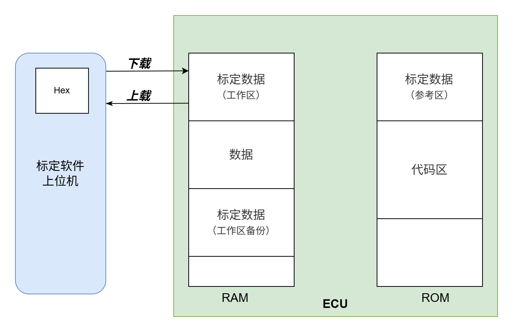
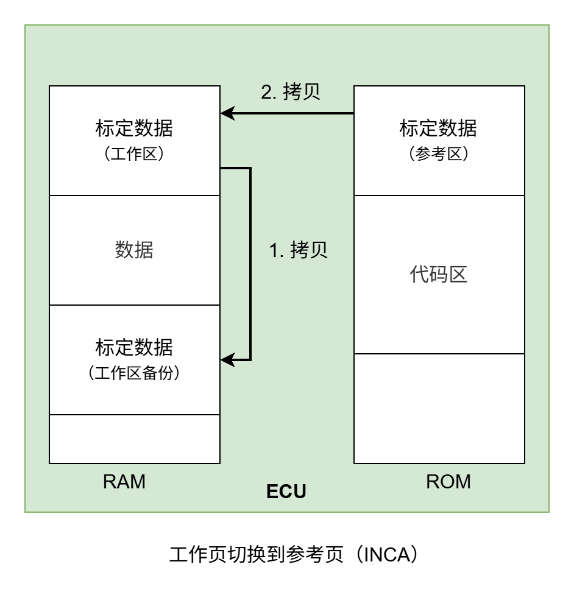
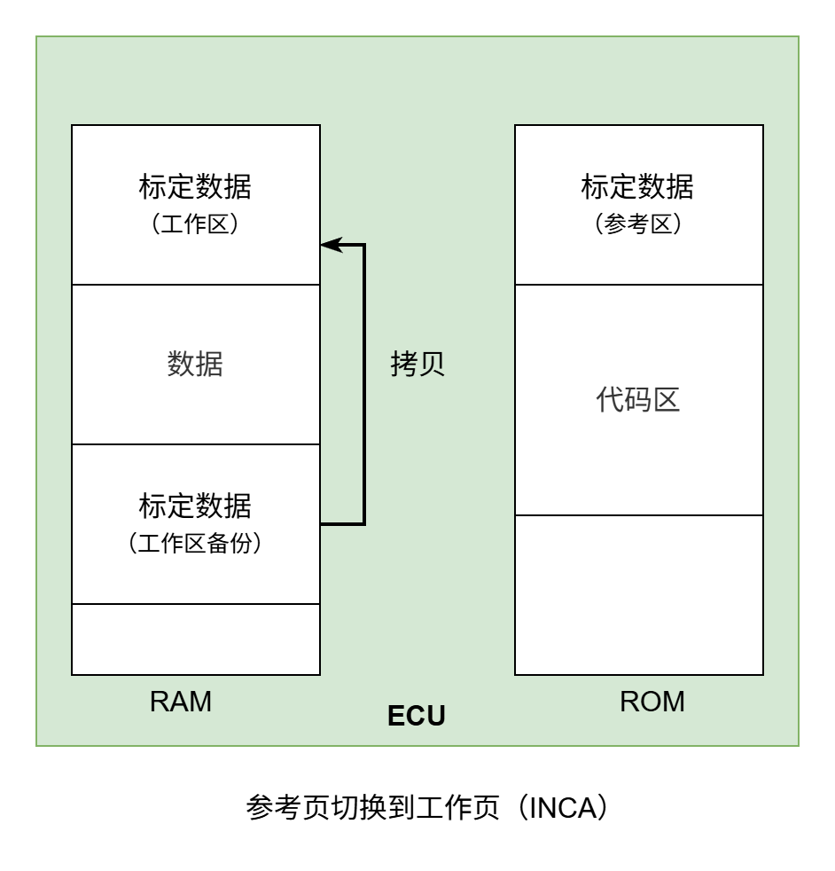

# 标定协议原理

## 为什么需要标定协议

现在一款汽车、机械臂。要有灵魂动起来，主要有机械运动部分、电子控制硬件部分、电子控制软件部分。软件部分又分为软件、和参数。比如车型A，区分高、中、低三个配置，但是其实不管是硬件还是内部代码基本都一样，不一样的是一些车型参数或者配置字。通过标定就能实现车型配置的切换，体现不一样的系统性能。

标定协议是汽车控制在编写程序后，部分功能实现的部分参数是需要在实车上才能确定的，当然在实车上调试过程中也需要监测一些数据才能进行调试工作。

在一些需要调试较少的系统中，可以一边调试一边优化参数重新下载程序。对于汽车这样复杂系统就变得不可能。因此诞生一种标定系统。程序工程师将程序编写架构搭建好，在编程过程中需要预知那些参数需要标定(实时修改)，那些变量需要观测(实时查看)。系统程序搭建好后，标定工程师即可在实车上实时查看、调试控制器。因此诞生一种标定协议。

## 标定协议规范

### ASAP标准
是几家德国汽车制造商联手一些著名的汽车电子设备制造商于1991年成立了ASAP标准组织， ASAP的英文全称是The working group for thestandardization of applicationsystems(应用系统标准化工作小组)，它的目标是使在汽车电子设备研发过程中相关的测试，标定，诊断方法及工具能够兼容并互换。

ASAP3是应用系统，即测试，标定，诊断系统(MCD Measurement， Calibration， Diagnosis System)到自动化系统的接口规范。这里的自动化系统可以是一个测量仪器的指示装置或汽车的燃油测量装置等。

ASAP2又称为ASAP描述文件，是控制单元内部数据描述文件的规范。 ASAP2文件用来具体描述电子控制单元内部的数据信息，包括数据存储的规范，数字量到物理量的转换规范等。

ASAP1是控制单元到MCD系统的接口规范，ASAP1规范又细分为ASAP1b与ASAP1a。ASAP1b接口下包括一个符合ASAP标准的驱动程序，硬件接口及电子控制单元。因此ASAP1b接口规范保证了MCD与ECU之间的通信，不受所选通信媒介及不同ECU供应商的限制。其中ASAP1a是到ECU端的数据通信的物理及逻辑接口规范，包括通过CAN总线对ECU进行标定的协议规范。

### ASAM标准组织及其规范
1998年ASAM小组成立，其英文全称是Association for Standardization of Automation and Measuring System(自动化及测量系统标准化小组)。ASAM标准是ASAP标准的扩展和衍生，在新的ASAM标准中，ASAP标准 变名为ASAM MCD(ASAM Measurement, Calibration and Diagnosis)，原来的ASAP1、ASAP2、ASPA3规范在新的标准下分别为ASAM-MCD 1MC、ASAMMCD 2MC、ASAM-MCD 3MC。


## 标定原理

单片机标定本质就是上位机将观测量的地址发送给控制器，控制器将该地址的数据返回给上位机，上位机将标定量的地址和数据发送给控制器，控制器将数据写到该地址，并返回确认信号给上位机。


## 单片机编译器原理

### 程序编译地址说明

链接脚本生成sections要被加载到memory中，内存分两种:

1. LMA：加载内存地址
2. VMA：运行内存地址（MMU虚拟内存地址）

在无MMU下，对于全局变量可以理解为，运行地址在LAM，初始值存在VMA。


### 局部变量编译测试

``` c
int main(void)
{
  //int a;
  printf("%d",2);
}

   text      data     bss     dec      hex
   7448     112    1072    8632    21b8 
```

``` c
int main(void)
{
  int a;
  printf("%d",a);
}

   text      data     bss     dec     hex
   7448     112    1072    8632    21b8
```
编译程序占用空间截图


### 全局变量编译测试

``` c
int main(void)
{
  //int a;
  printf("%d", 2);
}

   text      data     bss     dec      hex
   7448     112    1072    8632    21b8 
```
``` c
int b = 2;
int main(void)
{
  int a;
  printf("%d", b);
}

   text       data     bss     dec     hex
   7452     116    1076    8644    21c4
```

``` c
int b = 0;
int main(void)
{
  int a;
  printf("%d", b);
}

   text       data     bss     dec     hex
   7452     112    1080    8644    21c4
```

``` c
int b;
int main(void)
{
  int a;
  printf("%d", b);
}

   text       data     bss     dec     hex
   7452     112    1080    8644    21c4
```

### 堆栈编译测试

``` c
_Min_Heap_Size = 0x0;          /* required amount of heap  */
_Min_Stack_Size = 0x400;      /* required amount of stack */

int b;
int main(void)
{
  int a;
  printf("%d", b);
}

   text       data     bss     dec     hex
   7452     112    1080    8644    21c4
```

``` c
_Min_Heap_Size = 0x400;          /* required amount of heap  */
_Min_Stack_Size = 0x800;         /* required amount of stack */

int b;
int main(void)
{
  int a;
  printf("%d", b);
}

   text       data    bss     dec       hex
   7452     112    3128   10692    29c4
```

## 标定协议的底层实现

汽车控制器程序本质运行在SOC上，为了性能和稳定性是无GUI的。因此需要将标定工程师手中的PC作为标定的输入和输出。标定中需要实时和友好的标定软件(电脑端软件)通信。在汽车中广泛存在CAN控制器域网，自然首要选择它作为标定的通信通道。XCP已经扩展到USB、以太网等等接口。

因此我们可以借助加载内存地址和运行内存地址，RAM为标定数据的运行地址、ROM存储标定初始地址。当汽车控制器上电是将ROM标定区的数据搬移到RAM标定区，程序运行时使用RAM标定区的参数，标定过程中就能实时修改RAM标定参数，当标定参数确定以后，将RAM标定区数据存储到ROM标定区，这样下次上电则是最新的标定参数。


当然仅仅只支持标定软件监测的参数(观测量)直接是定义在RAM中的变量，用来实时存储程序运行的部分参数并支持发送给标定软件即可，也不关心存放在ROM的初始值。


## 标定分区原理

### 标定数据需求

1. 标定数据在能修改，作为程序模块输入 - 运行内存地址必须在RAM
2. 标定数据能被断电保存 - 加载内存地址必须在ROM
3. 标定数据能在不改变程序情况下统一单独重新加载 -  所有标定数据地址相连

### 链接脚本说明

``` c
//将所有.o文件中的rdata段放在rdata段中
.rdata : 
{
    . = ALIGN(4);
    *(.rdata) 
    *(.rdata*)
    . = ALIGN(4);
} >FLASH  //LMA和VMA相同
  
//将所有.o文件中的data段放在data段中
.data :
{
    . = ALIGN(4);
    *(.data)
    *(.data*)
    . = ALIGN(4);
} >RAM AT> FLASH //VMA在RAM中，LMA在FLASH中
  
```
AT>就是用于指定这个section的加载内存地址(LMA)
因此我的CAL分区如下方法定义：

``` c
MEMORY
{
    cal_rom        :org = 0x00800000,        len = 256K
    vector			 :org = 0x00840000,        len = 1K
    flash              :org = 0x00840400,        len = 512K
    
    noinit            :org = 0x40000400,        len = 1K
    cal_ram         :org = 0x40000400,        len = 32K
    ram               :org = 0x40008400,        len = 256K
}
.cal :
{
    . = ALIGN(4);
    *(.CAL)
    . = ALIGN(4);
} >cal_ram AT> cal_rom

#pragma section ".CAL"
//这里放标定变量
#pragma section
```

## 标定数据同步原理
### 上载下载

标定软件在每次链接时会校验标定区数据的校验和，如果ECU和上位机的校验和不一致就会弹出提示。---INCA
这时我们可以选择将标定数据上载到上位机中同步数据，或者将上位机中Hex中数据下载到ECU中同步数据。



### 工作页参考页切换（INCA）

我的理解：将标定的数据恢复到初始状态查看程序运行逻辑。
将标定数据保存到备份区，然后将ROM中数据拷贝到RAM中。


将备份区标定数据恢复。


