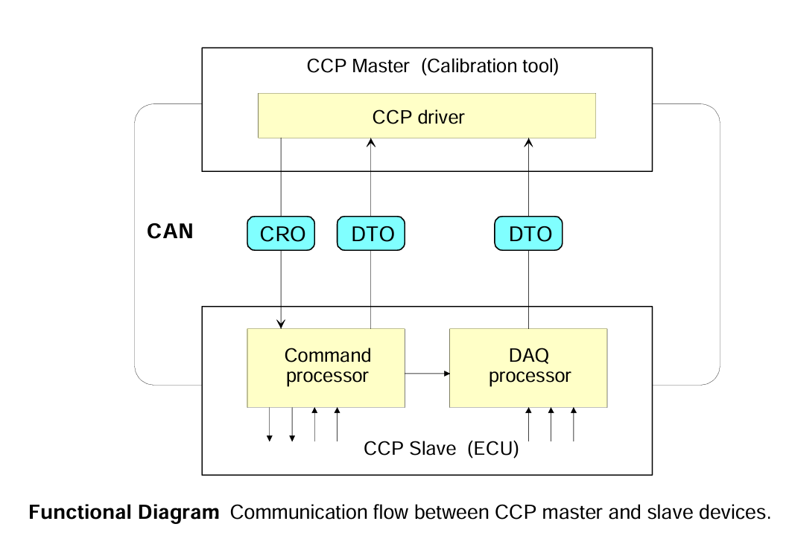
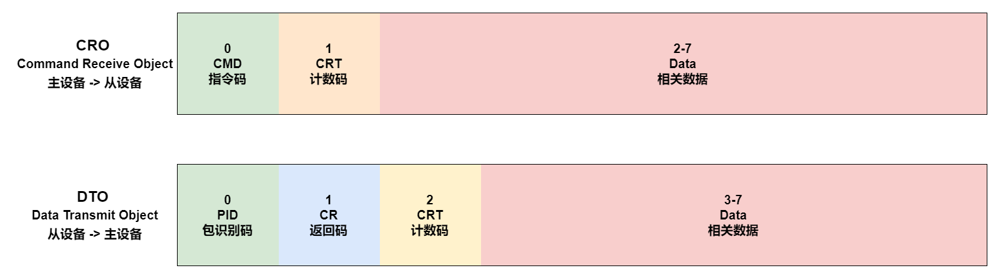
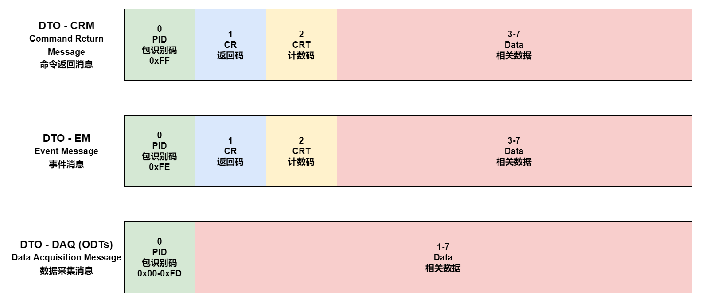
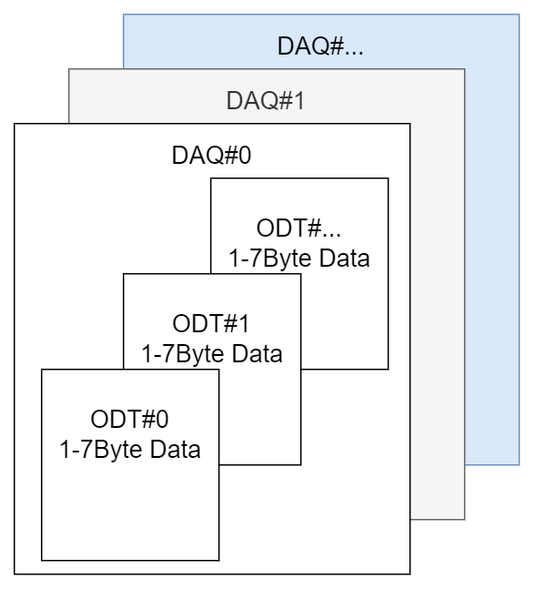
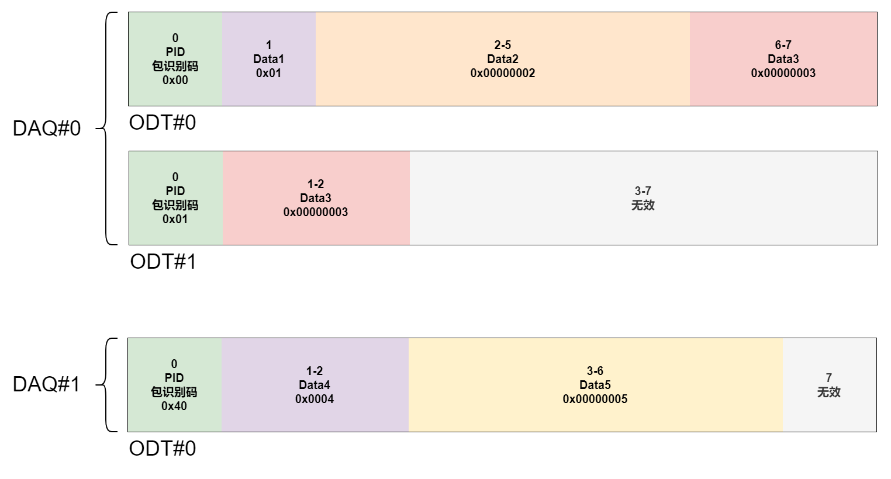
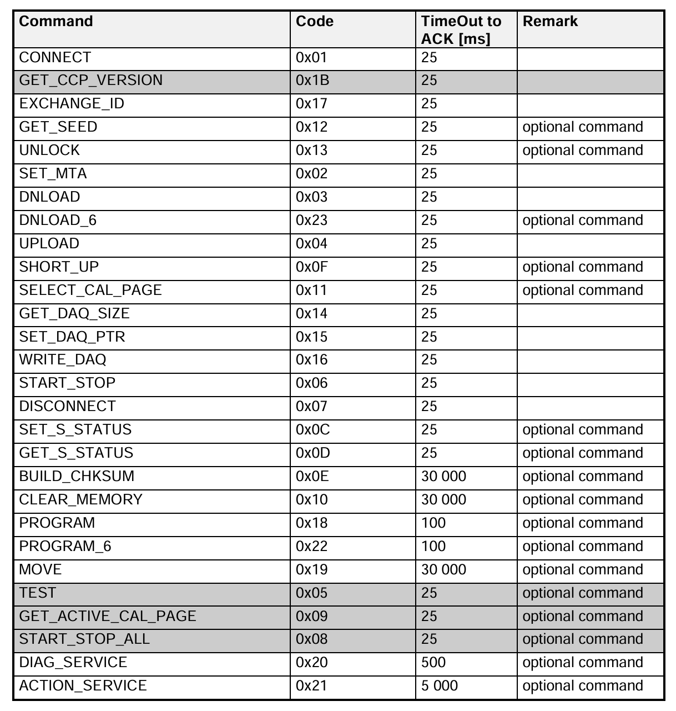
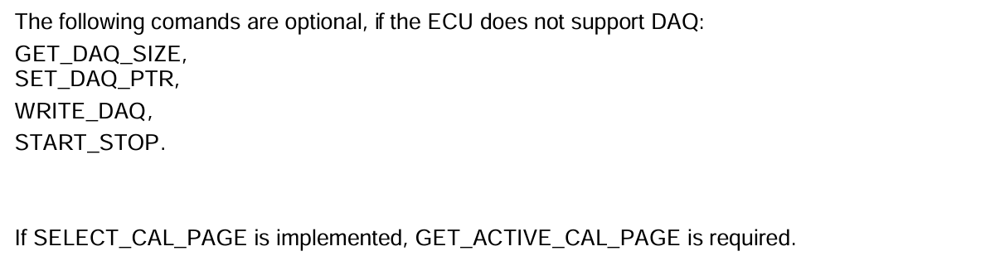

# CCP协议剖析

## CCP协议指令格式

CCP协议是运行在CAN接口之上的标定协议(ASAP1a)，CCP的全称是CAN Calibration Protocol。 CCP协议遵从CAN2.0B通信规范，支持11位标准与29位扩展标识符。数据都是8字节对齐。

CRO是主设备(标定软件)发送给从设备(控制器)的指令；DTO是从设备发送给主设备的数据。

- CRO中CMD(命令码)范围0x00-0xFF，具体含义见指令详解。
- DTO中PID(包识别码)范围0x00-0xFF，具体含义见DTO详解。
- CRO、DTO中的CRT(命令计数码)在一问一答通讯模式中每次加一。对应CRO、DTO的计数码相等。

### DTO详解

DTO的PID分为三类：

1. CRM是PID=0xFF的情况，主要是在一问一答通讯模式中回复CRO。
2. EM是PID=0xFE的情况，主要是从设备主动发送数据给主设备，例如从设备遇到一些错误等消息需要上报。
3. DAQ是PID=0x00-0xFD的情况，主要是数据采集模式下从设备主动发送采集数据到主设备。

### DAQ详解

DAQ就是从设备向标定软件发送的数据采集信息。也就是将当前控制器中参数发送给标定软件。

- 一个ODT表最多有7Byte的数据，一个ODT就对应一个DTO，也就是一帧CAN报文。
- 一个DAQ表有多个ODT表。每张DAQ表不可能只有7Byte的数据量，需要多个ODT来传输。
- 一个标定系统有多张DAQ表。每张DAQ表的采集周期一般不一样。

为什么这样区分呢？因为标定系统需要的参数可能需要监测周期不一样。例如一些数据需要10ms报告一次，一些数据需要100ms报告一次。这样利于标定工程师观测参数。因此每张DAQ表的采集周期不一样。

### DAQ举例

- 一个标定系统有两张DAQ
    - DAQ#0采集周期为10ms，ODT编号0x00-0x3F。
        - 采集数据Data1(uint8) = 0x01
        - 采集数据Data2(uint32) = 0x00000002
        - 采集数据Data3(uint32) = 0x00000003
    - DAQ#1采集周期为100ms，ODT编号0x40-0x7F。
        - 采集数据Data4(uint16) = 0x0004
        - 采集数据Data5(uint32) = 0x00000005

## CCP协议指令概述

