# CCP指令详解

### 必须支持指令

#### 0x01: CONNECT(M)

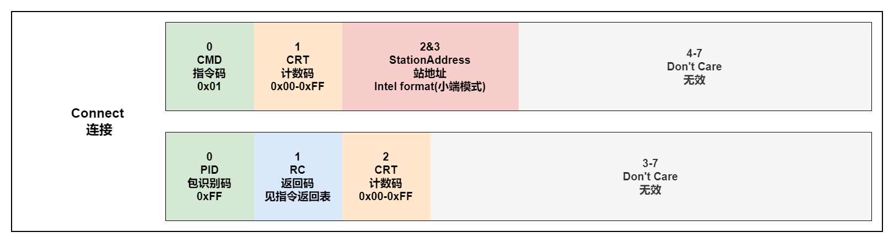

站地址是一个16bit的数字。

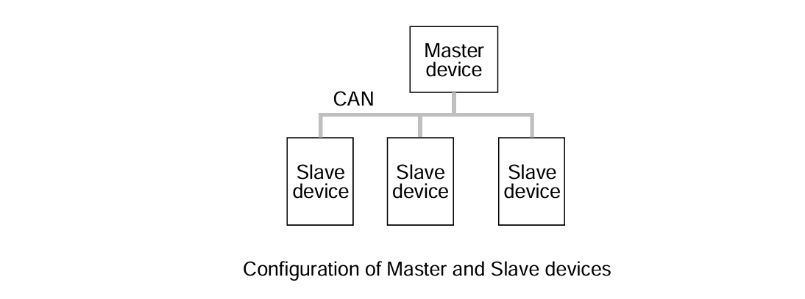

#### 0x17: EXCHANGE_ID(M)

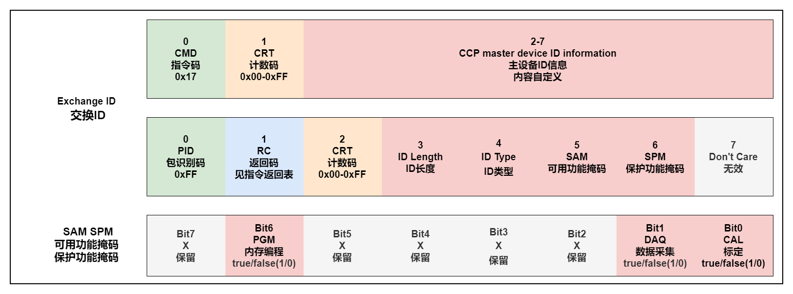

可用资源掩码: 当bit=TRUE，指定的资源或函数可用。

保护资源掩码: 当bit=TRUE，指定的资源或功能被保护防止未经授权的访问(需要解锁)。

ID用于设置MTA0为上传请求的地址，方便随后使用UPLOAD命令。

#### 0x02: SET_MTA(M)

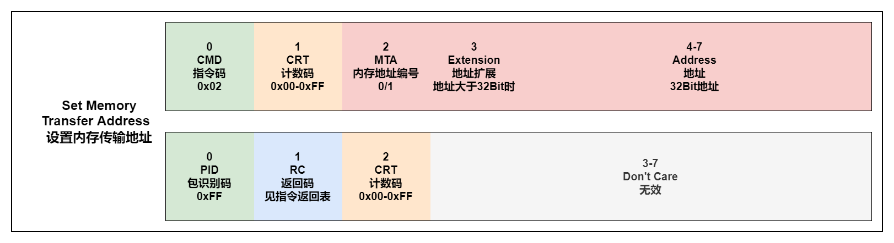

设置MTA的地址，地址=32bit地址+扩展。

MTA0用于DOWNLOAD、UPLOAD、DNLOAD_6、SELECT_CAL_PAGE、CLEAR_MEMORY、PROGRAM、PROGRAM_6、MOVE。

MTA1用于MOVE。

#### 0x03: DOWNLOAD(M)

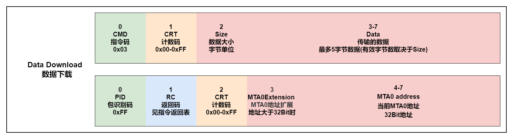

包含的指定长度(大小)的数据块将被复制到设备的内存，从当前内存传输地址0(MTA0)开始。MTA0指针将会后加Size值。

#### 0x04: UPLOAD(M)

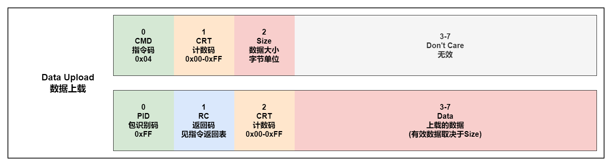

包含的指定长度(大小)的数据块将被上传到标定软件，从当前内存传输地址0(MTA0)开始。MTA0指针将会后加Size值。

#### 0x14: GET_DAQ_SIZE(M)

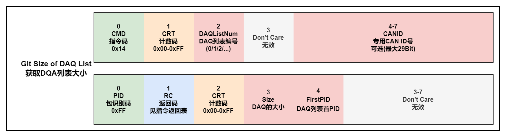

返回指定的DAQ列表的大小作为可用对象的数量并清除当前列表。如果指定的列表号不是Size=0应该返回。

#### 0x15: SET_DAQ_PTR(M)

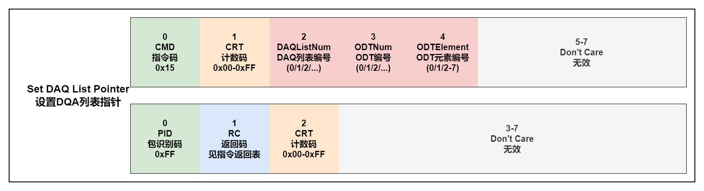

初始化DAQ列表指针，以便后续写入DAQ列表.

#### 0x16: WRITE_DAQ(M)

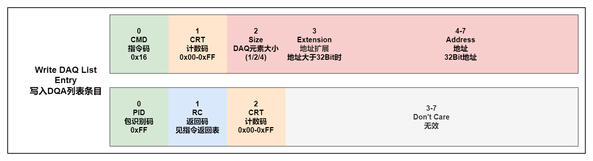

将一个条目(单个DAQ元素的描述)写入由DAQ列表定义的DAQ列表指针(见SET_DAQ_PTR)。定义了以下DAQ元素的大小:1byte，2bytes (type word)，4字节(type long / Float)。ECU可能不支持每个元素和2或4字节的单独地址扩展元素的大小。兼容ECU的限制是主控设备的责任。限制可以在从设备描述文件(ASAP2)中定义。

#### 0x06: START_STOP(M)

该命令用于启动或停止数据采集或准备同步数据开始指定的DAQ列表。LastODTNum编号指定哪些ODT(从0到此DAQ列表的最后ODT号码)应传送。事件通道号指定有效地确定数据传输时序的通用信号源。

#### 0x07: DISCONNECT(M)

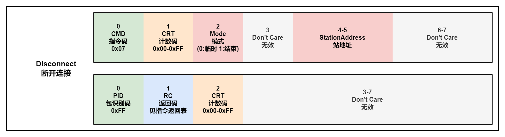

断开备用设备的连接。断开可以是暂时的，设置从设备处于“脱机”状态或参数0x01终止校准会话。终止会话将使所有状态信息失效，并重置从保护的地位。临时断开不会停止DAQ消息的传输。

#### 0x1B: GET_CCP_VER(M)

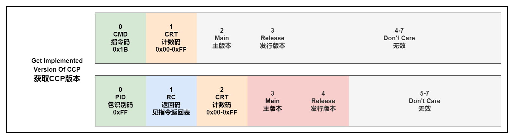

此命令用于对协议版本进行相互识别主设备和从设备在通用协议版本上达成一致。这命令的执行时间应该在EXCHANGE_ID命令之前。

### 可选支持指令

#### 0x12: GET_SEED(O)

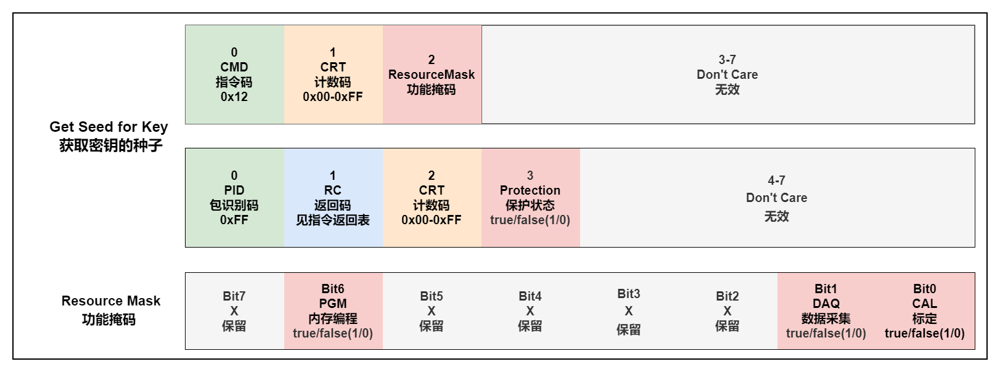

用于解锁设备时获取种子。

#### 0x13: UNLOCK(O)

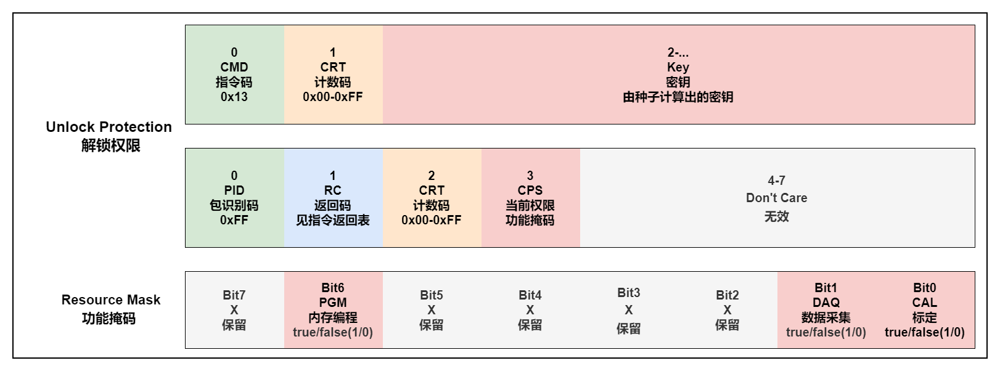

发送生成的密钥解锁设备。

#### 0x23: DOWNLOAD6(O)

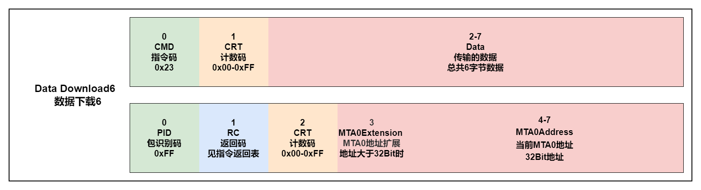

包含的固定长度(6字节)的数据将被复制到设备的内存，从当前内存传输地址0(MTA0)开始。MTA0指针将会后加6。

#### 0x0F: SHORT_UP(O)

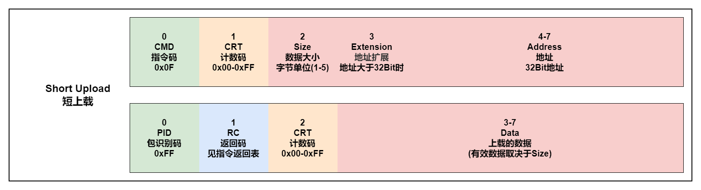

指定长度(大小)的数据块，从源地址开始将被复制到对应的DTO数据字段。MTA0指针保持不变。

#### 0x11: SELECT_CAL_PAGE(O)

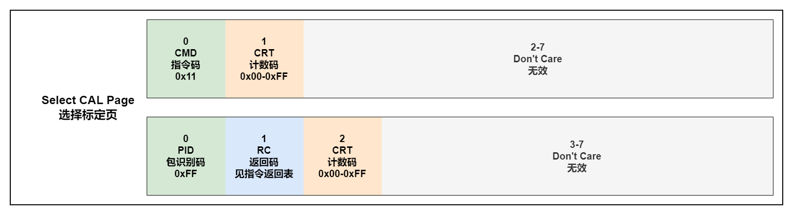

该命令的功能依赖于ECU的实现。之前初始MTA0指向选定为当前活动的校准数据页的起点通过这个命令分页。

#### 0x0C: SET_S_STATUS(O)

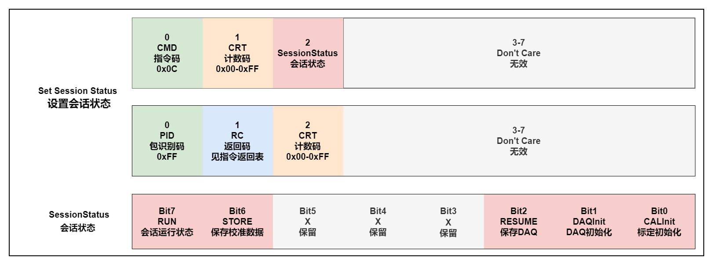

设置从节点了解校准会话的当前状态。

#### 0x0D: GET_S_STATUS(O)

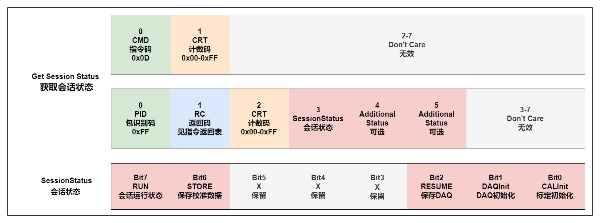

获取从节点了解校准会话的当前状态。

#### 0x0E: BUILD_CHKSUM(O)

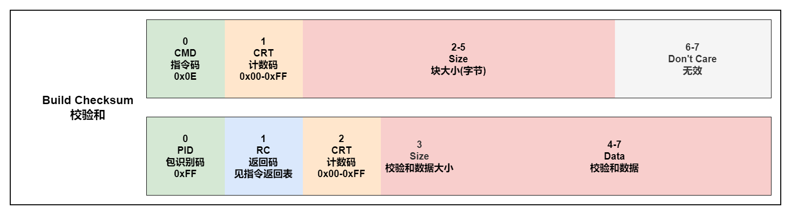

返回由MTA0定义的内存块的校验和结果(内存传输区域起始地址)和块大小。校验和算法可能是制造商和/或项目具体，它不是本规范的一部分。

#### 0x10: CLEAR_MEMORY(O)

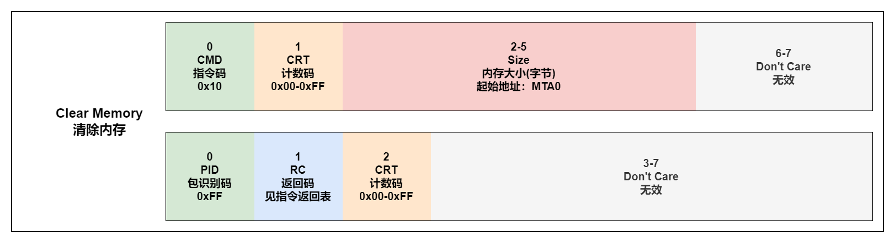

此命令可用于在重编程前擦除FLASH EPROM。的MTA0指针指向要擦除的内存位置。

#### 0x18: PROGRAM(O)

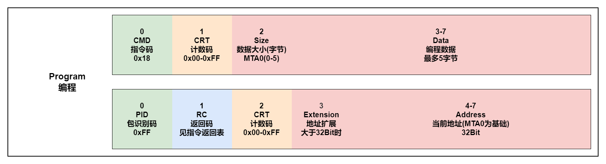

指定长度(大小)的数据块将被编程成非易失性存储器(FLASH, EEPROM)，从当前MTA0开始。MTA0指针将会后加Size值。

#### 0x22: PROGRAM6(O)

国定长度(6字节)的数据块将被编程成非易失性存储器(FLASH, EEPROM)，从当前MTA0开始。MTA0指针将会后加Size值。

#### 0x19: MOVE(O)

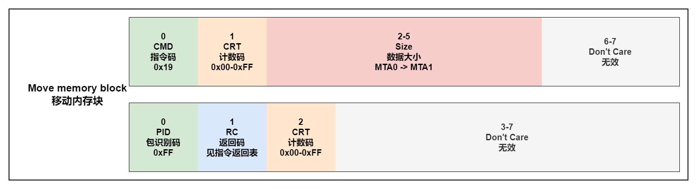

指定长度(大小)的数据块将从MTA 0定义的地址复制(源指针)指向MTA 1定义的地址(目的指针)。

#### 0x20: DIAG_SERVICE(O)

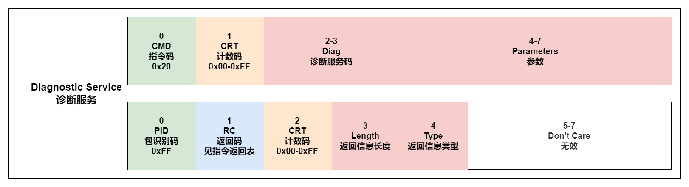

从设备执行请求的服务，并自动设置内存传输地址MTA0到CCP主设备(主机)可能来自的位置随后上传所请求的诊断服务返回信息。

#### 0x21: ACTION_SERVICE(O)

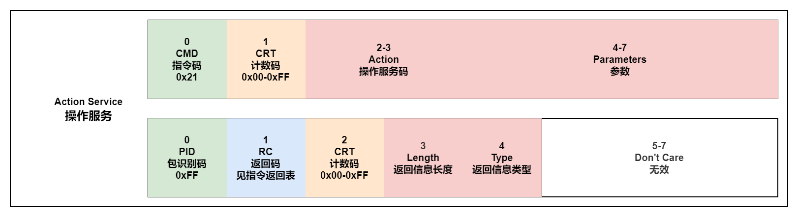

从设备执行请求的服务，并自动设置内存传输地址MTA0到CCP主设备的位置随后上传所请求的操作服务返回信息(如果适用)。

#### 0x05: TEST(O)

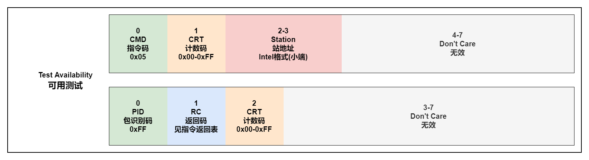

该命令用于测试指定站点地址的从站是否存在可供CCP沟通。此命令不建立逻辑连接，也不会在指定的从站中触发任何活动。站地址(Station)指定为小端字节顺序的数字(Intel格式)。

#### 0x08: START_STOP_ALL(O)

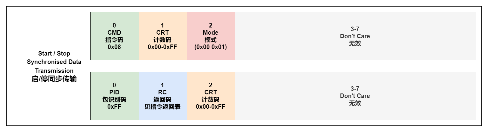

该命令用于启动所有DAQ列表的周期传输使用之前发送START_STOP命令(启动/停止方式= 2)以同步方式作为“准备开始”。该命令用于停止所有DAQ列表(包括未启动的)的定期传输同步。

#### 0x09: GET_ACTIVE_CAL(O)

控件中当前活动的校准页的起始地址从设备。

### 指令错误代码

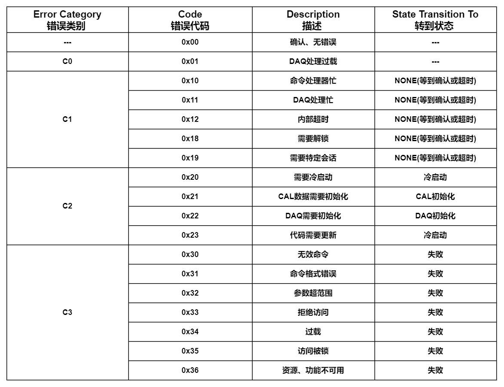