# XCP协议剖析

## XCP协议背景

CCP协议是基于CAN的标定协议，随着发展标定不再满足于CAN通信，因此发展出XCP来支持CAN、USB、TCP/IP、UDP/IP。它与CCP具有渊源。

XCP提供以下基本功能：

- 同步数据采集
- 同步数据激励
- 在线内存校准（读/写访问）
- 校准数据页面初始化和切换
- 用于ECU开发的Flash编程

XCP提供以下可选的新功能：

- 各种传输层（CAN、以太网、USB、...）
- 块通信模式
- 交错通信模式
- 动态数据传输配置
- 时间戳数据传输
- 数据传输同步
- 数据传输的优先级
- 原子位修改
- 按位数据刺激

与CCP 2.1相比，XCP改进了以下功能：

- 兼容性和规范
- 效率和吞吐量
- 开机数据传输
- 数据页面冻结
- 自动配置
- 闪存编程

XCP是根据以下原则设计的：

- 最小的从资源消耗（RAM、ROM、运行时资源）
- 高效的通信
- 简单的从设备实现

## XCP消息帧结构说明

所有XCP通信都作为称为XCP数据包的数据对象传输。
有2种基本的数据包类型：

1. 用于传输通用控制命令的数据包：CTO
2. 用于传输同步数据的数据包：DTO

- CTO（命令传输对象）用于传输通用控制命令
  - 它用于执行协议命令（CMD）
  - 传输命令响应（RES）
  - 错误（ERR）数据包
  - 事件（EV）数据包
  - 服务请求数据包（SERV）

- DTO（数据传输对象）用于传输同步数据采集数据（DAQ）和传输同步数据刺激数据（STIM）。

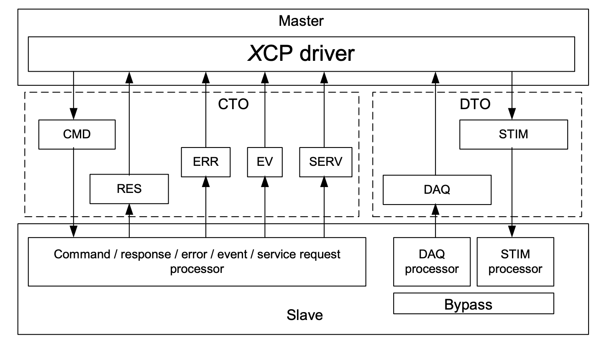

## XCP协议的帧格式

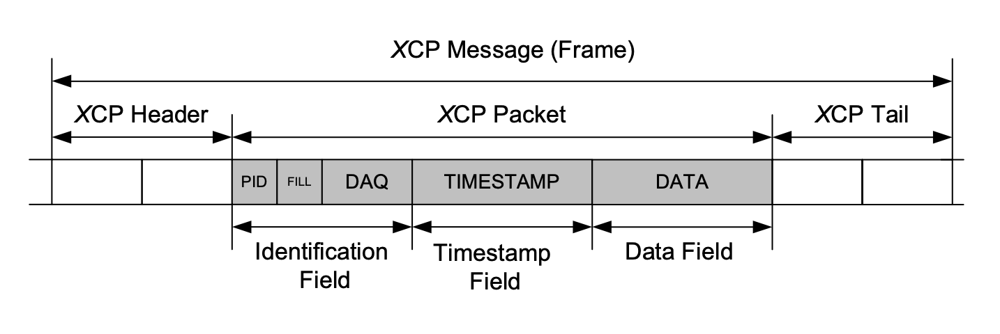

1. XCP帧格式由头部、数据包、尾部组成，头部尾部根据协议在不同通信方式上有所区别。
2. XCP数据包包含协议的通用部分，独立于使用的传输层。
3. XCP数据包由标识字段、可选时间戳字段、数据字段组成。

### 头部尾部

头部尾部根据协议在不同通信方式上有所区别。

### 标识字段

XCP数据包基本上总是以标识字段开头，该字段作为第一个字节包含数据包标识符（PID）。

#### 主设备到从设备的标识字段

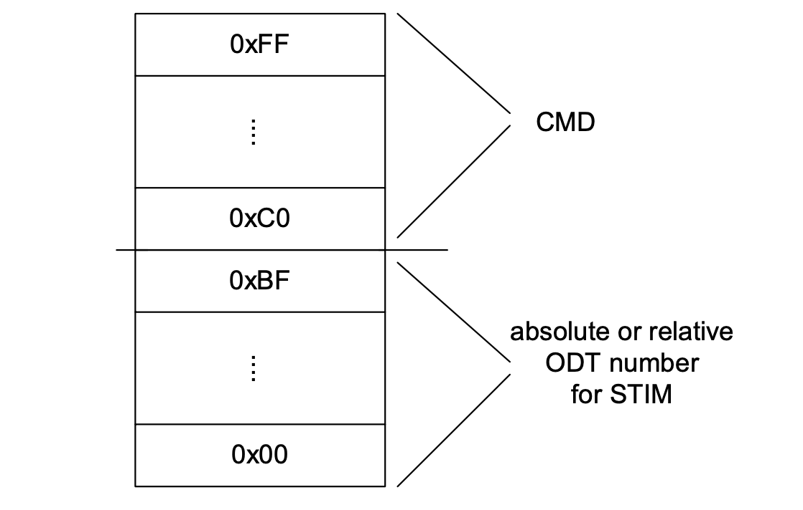

#### 从设备到主设备的标识字段

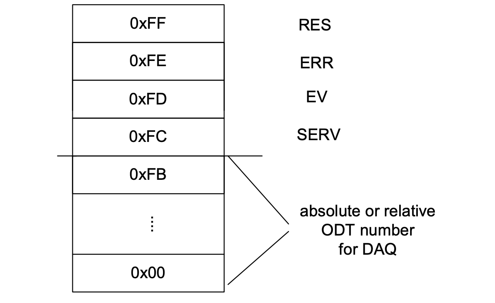

### 数据段

1. 对于CTO数据包，数据字段包含不同类型的CTO数据包的特定参数。
2. 对于DTO数据包，数据字段包含用于同步获取和激励的数据。

## CTO

CTO（Command Transfer Object）用于传输通用控制命令。

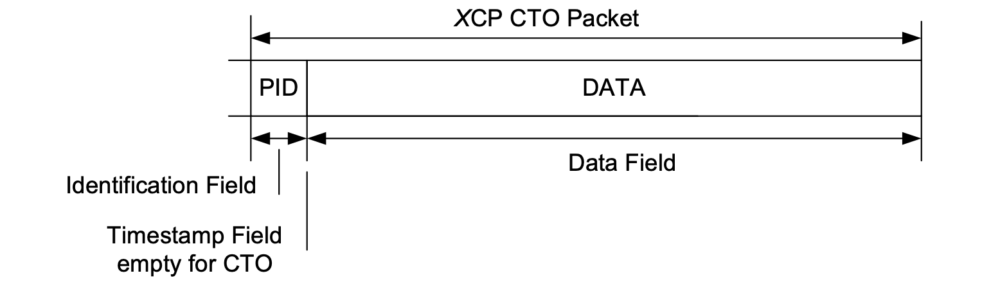

1. 识别字段仅由PID组成，其中包含CTO数据包代码。时间戳字段不可用。
2. 数据字段包含不同类型的CTO数据包的特定参数。

### CMD

CMD（Command Packet）的PID包含0xC0 <= CMD <= 0xFF范围内的代码。所有可能的命令代码都在命令代码（CMD）定义。

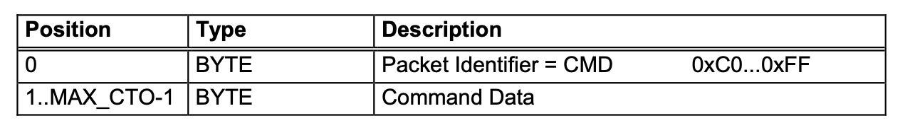

### RES

RES（Command Response packet）PID包含命令正响应包代码RES = 0xFF。如果命令成功执行，RES将作为CMD的回复发送。

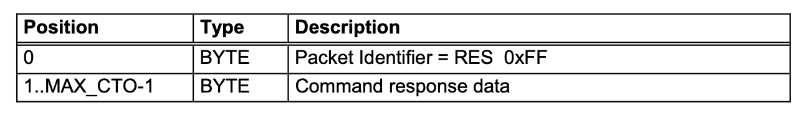

### ERR

ERR（Error packet）的PID包含数据包代码ERR = 0xFE。如果命令未成功执行，ERR将作为CMD的响应发送。第二个字节包含错误代码。后续定义了错误代码。

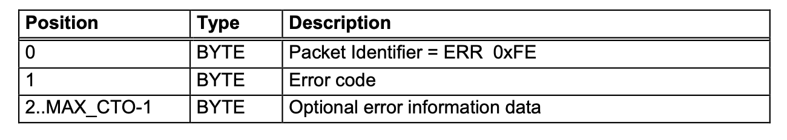

### EV

EV（Event packet）的PID包含数据包代码EV = 0xFD。如果从设备想要报告异步事件包，则发送EV。第二个字节包含事件代码。后续定义了事件代码。实现是可选的。从设备发送到主设备的事件数据包无被确认回复，因此不能保证传输。

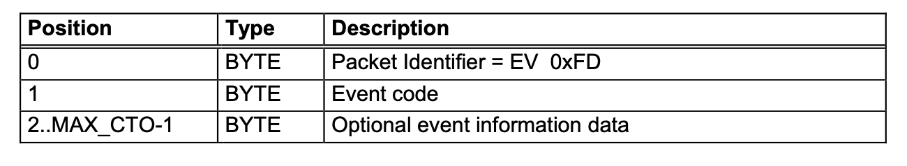

### SERV

SERV（Service Request packet）的PID包含请求包代码SERV = 0xFC。SERV要求主设备执行一些操作。第二个字节包含服务请求代码。可能的服务请求代码在后续定义。

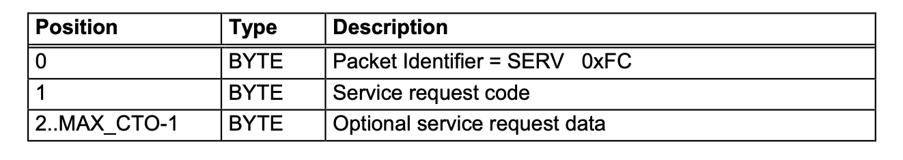

## DTO

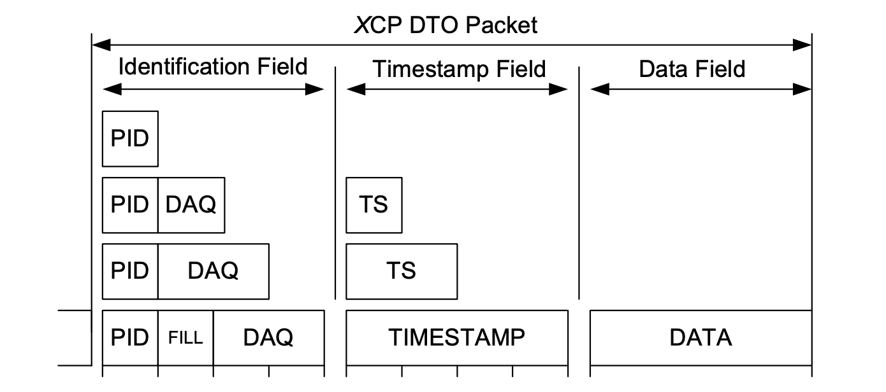

DTO用于传输同步数据采集数据（DAQ）和传输同步数据刺激数据（STIM）。
识别字段的内容因识别字段类型而异。
时间戳字段的内容因时间戳字段类型而异。
识别字段类型和时间戳字段类型的任何组合都是可能的。
数据字段包含用于同步获取和刺激的数据。

### DAQ

PID包含0x00 <= DAQ <= 0xFB范围内的（绝对或相对）ODT数。ODT编号是指对象描述符表（ODT），该表描述了剩余数据字节中包含哪些数据采集元素。

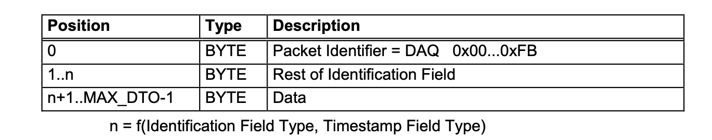

### STIM

PID包含0x00 <= STIM <= 0xBF范围内的（绝对或相对）ODT编号。ODT编号是指相应的对象描述符表（ODT），该表描述了剩余数据字节中包含哪些数据刺激元素。

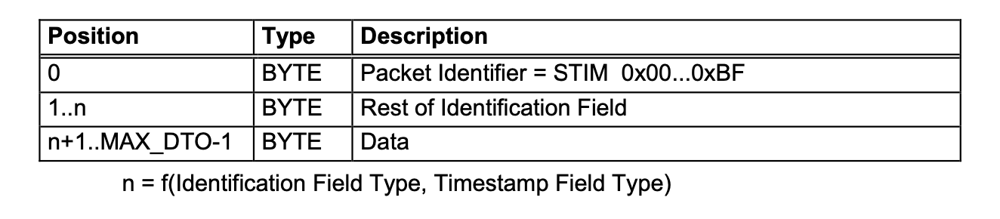

### 相关代码

#### 错误代码

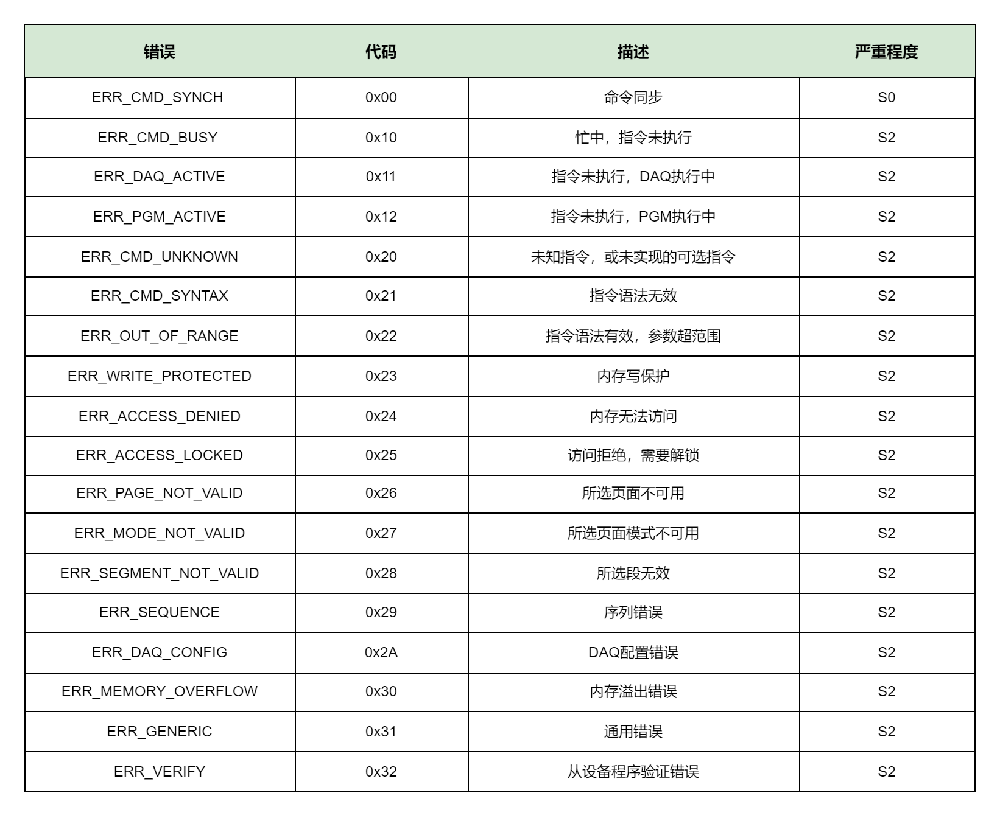

#### 事件代码

下表中的事件数据包代码可以作为PID = 0xFD的异步数据包发送。实现是可选的。从设备发送到主设备的事件数据包不被确认，因此不能保证传输。

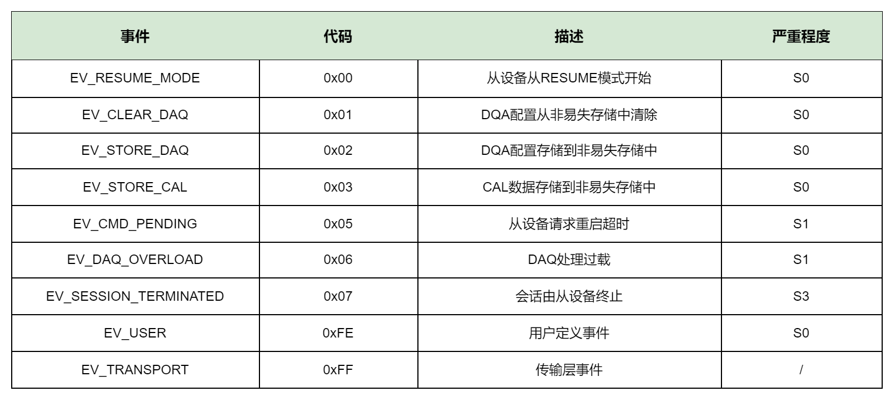

#### 服务代码

下表中的服务请求数据包代码可以作为PID = 0xFC的异步数据包发送。对于从设备来说，实现是可选的，但对于主设备来说是强制性的。从设备发送到主设备的服务请求包不被确认，因此不能保证传输。

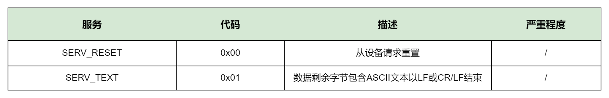

### 命令代码

#### CMD-STD(标准命令)

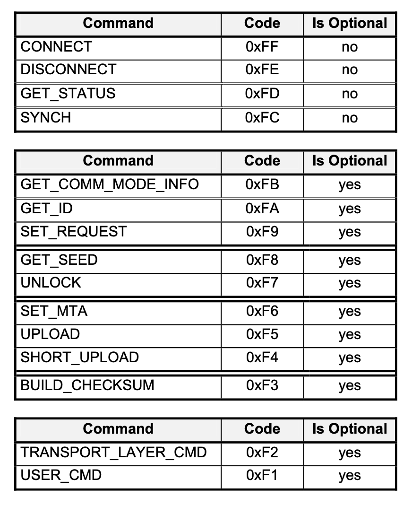

#### CMD-CAL(标定命令)

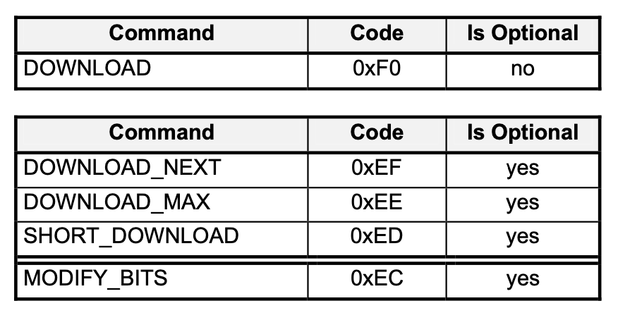

#### CMD-PAG(页切换命令)

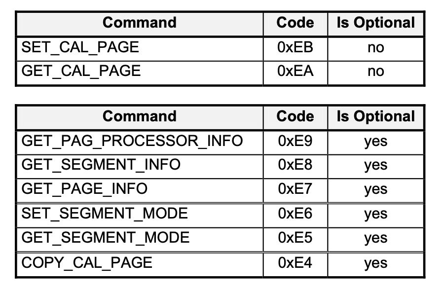

#### CMD-DAQ(数据采集命令)

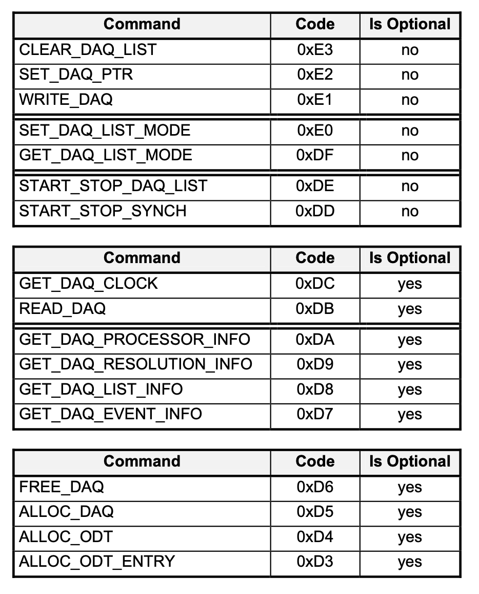

#### CMD-PGM（储编程命令）

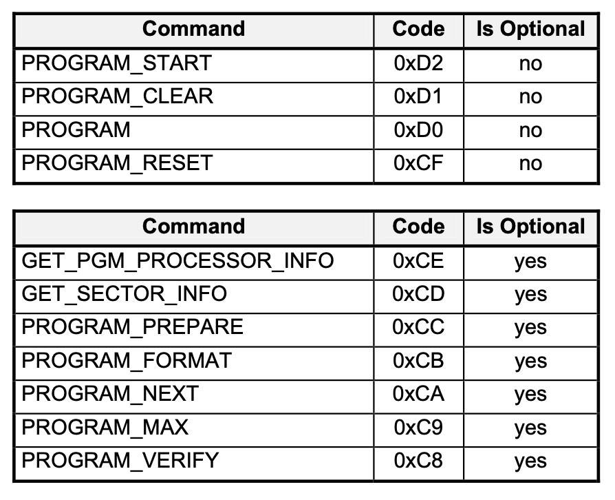