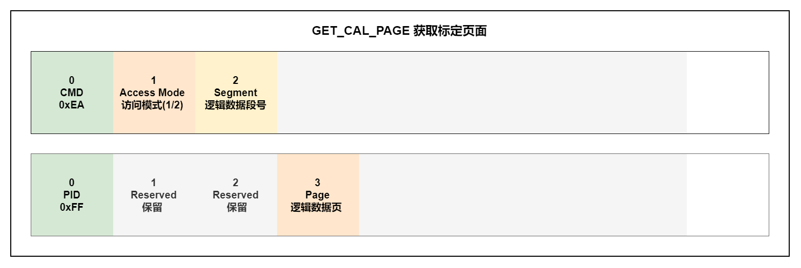
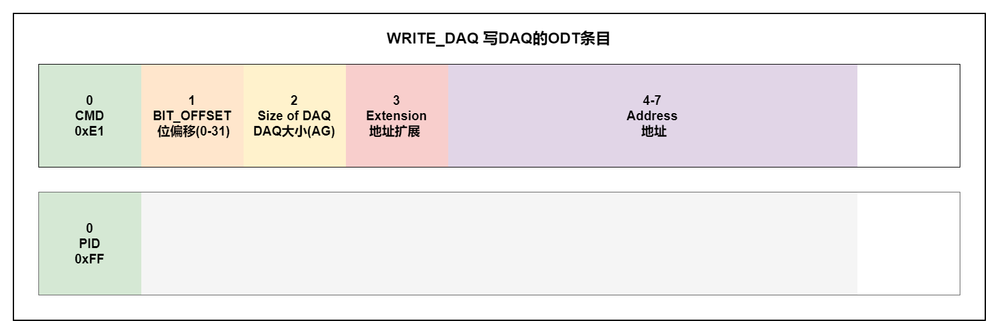

# XCP指令详解

## 标准(STD)指令

### 必实现指令

#### 0xFF:CONNECT

该命令与从设备建立一个连续的、逻辑的、点到点的连接设备。在运行XCP会话期间(已连接)，此命令对任何XCP会话不没有影响任何XCP从设备的配置。
从设备在非连接状态时不响应任何其他命令(除了自动检测)。

Mode参数：

- Mode = 0x00(Normal) 主机可以与从设备启动XCP通信。
- Mode = 0x01(user defined) 主机可以启动XCP通信同时告诉从机它应该进入一个特殊的(用户定义的)模式。

RESSOURCE参数：

- CAL/PAG、DAQ、STIM、PGM = 1 表示该资源可用，反之不可用。

COMM_MODE参数：

- ADDRESS_GRANULARITY_1、ADDRESS_GRANULARITY_0：
  - 00： ADDRESS_GRANULARITY=BYTE	AG=1
  - 01： ADDRESS_GRANULARITY=WORE	AG=2
  - 10： ADDRESS_GRANULARITY=DWORD	AG=4
  - 11： ADDRESS_GRANULARITY=保留	   AG=保留

- SLAVE_BLOCK_MODE参数：
  - 1：表示从机块模式可用
  - 0：表示从机块模式不可用

- OPTIONAL参数：
  - 1：表示支持类型的附加信息的通信模式
  - 0：表示不支持类型的附加信息的通信模式

MAX_CTO参数：

- 最大CTO大小，单位为字节。

MAX_DTO参数：

- 最大DTO大小，单位为字节。

> 注意：MAX_CTO、MAX_CTO必须始终满足下列关系：
> MAX_CTO mod AG = 0
> MAX_DTO mod AG = 0
> 所有涉及从设备地址范围的长度信息都基于AG(元素)。
> 如果长度信息指的是数据流(XCP协议)，则它是基于字节。

#### 0xFE:DISCONNECT

#### 0xFD:GET_STATUS

Session参数：

- STORE_CAL_REQ：STORE_CAL_REQ = 1标志表示保存校准数据到非易失性内存的挂起请求。一旦请求被满足，从设备将重置该位。从设备可以通过传输EV_STORE_CAL来指示。
- STORE_DAQ_REQ：STORE_DAQ_REQ = 1标志表示保存DAQ列表设置到非易失性内存的挂起请求。一旦请求被满足，从设备将重置该位。从设备可以通过传输EV_STORE_DAQ来指示。
- CLEAR_DAQ_REQ：CLEAR_DAQ_REQ = 1标志表示清除所有非易失中DAQ列表的挂起请求。所有ODT表项重置为address = 0, extension = 0, size = 0, bit_offset = FF。会话配置ID重置为0。一旦请求得到满足，从设备将重置该位。从设备可以通过发送信号EV_CLEAR_DAQ来指示。
  如果从设备不支持所请求的模式，返回ERR_OUT_OF_RANGE。
- DAQ_RUNNING=1：表示至少有一个DAQ列表已经启动并处于状态运行模式。
- RESUME=1：表示从机处于RESUME模式。

Protection参数：

- CAL/PAG：CAL/PAG = 1 表示该资源受保护需要解锁才能使用。
- DAQ：DAQ = 1 表示该资源受保护需要解锁才能使用。
- STIM：STIM = 1 表示该资源受保护需要解锁才能使用。
- PGM：PGM = 1 表示该资源受保护需要解锁才能使用。

> 标准命令永远不会被保护

#### 0xFC:SYNCH

该命令用于同步超时后的命令执行，SYNCH命令将始终有一个带有错误代码的否定响应ERR_CMD_SYNCH。没有其他命令使用此错误代码。

### 可选实现指令

#### 0xFB:GET_COMM_MODE_INFO

COMM_MODE参数：

- MASTER_BLOCK_MODE参数：表示主设备的块模式是否可用。如果支持主设备块模式：
  - 则MAX_BS为允许的最大块大小作为连续命令包的数量(DOWNLOAD_NEXT或PROGRAM_NEXT)。
  - MIN_ST所需的最小值，是一个块的数据包从主设备传输到从设备的分离时间，单位为100微秒。

- INTERLEAVED_MODE参数：表示交错模式是否可用。如果存在交错模式：
  - QUEUE_SIZE为最大数目。主站可以向从站的接收队列发送连续的命令包。

#### 0xFA:GET_ID

Type参数：

- 0：ASCII文本
- 1：ASAM-MC2文件名，没有路径和扩展
- 2：ASAM-MC2文件名，有路径和扩展
- 3：ASAM-MC2文件所在的URL路径
- 4：ASAM-MC2文件上传
- 128-255：自定义

Length参数：

- 指定标识中的字节数。如果length为0，则请求的标识类型不可用。
- 数据元素是BYTE, WORD或DWORD，取决于AG。
- Mode=0时，从设备将MTA (Memory Transfer Address)设置为当前地址。主设备可以使用一个或多个UPLOAD命令。
- 标识字符串是ASCII文本格式，它没有0结尾。

#### 0xF9:SET_REQUEST

Mode参数：

- STORE_CAL_REQ：标记了将校准数据保存到非易失性内存中的请求。可以通过GET_STATUS获取的STORE_CAL_REQ位，该位将被从机重置当请求已完成。从设备可以通过传输EV_STORE_CAL来指示传输。
- STORE_DAQ_REQ：标记了一个保存所有DAQ列表的请求。目标是START_STOP_DAQ_LIST指令选择的非易失性内存。从设备还必须存储非易失性内存中的会话配置id。在保存时，从设备首先必须清除可能已经存在的任何DAQ列表配置。可以通过GET_STATUS获得的STORE_DAQ_REQ位，该位将被从机重置当请求已完成。从设备可以通过传输EV_STORE_DAQ来指示传输。
- CLEAR_DAQ_REQ用于清除非易失性内存中的所有DAQ列表。所有ODT条目reset address = 0, extension = 0, size = 0, bit_offset = FF，会话配置ID重置为0。通过GET_STATUS获得的CLEAR_DAQ_REQ位，该位将被从机重置当请求已完成。从设备可以通过传输EV_CLEAR_DAQ来指示。

>如果从设备不支持所请求的模式，则返回ERR_OUT_OF_RANGE。

#### 0xF8:GET_SEED

Mode参数：

- Mode=0：第一部分种子获取
- Mode=1：剩余种子获取

Resource参数：

- Mode=0：Resource=需要解锁的资源
- Mode=1：Resource不关心

Length参数：

- Mode=0：Length=主设备请求种子总长度。
- Mode=1：Length=主设备请求种子剩余长度。(Length大于MAX_CTO-2是才使用该模式)

> 主设备必须在定义的顺序中使用GET_SEED(Mode=1)和GET_SEED(Mode= 0)。
> 如果主设备直接发送GET_SEED(Mode=1)，而不在之前使用GET_SEED(Mode=0)，从服务器返回一个ERR_SEQUENCE为负响应。

Resource参数：

- 请参阅GET_STATUS(资源保护状态)命令。

>一个GET_SEED命令只能请求一个资源。如果不止一个资源必须被解锁，(GET_SEED+UNLOCK)序列必须执行多次。主服务器不请求任何资源或请求多个资源，从机将响应ERR_OUT_OF_RANGE。

#### 0xF7:UNLOCK

使用种子算的密钥来解锁从机的安全保护。种子由之前的GET_SEED序列获得。
Length参数：

- 表示剩余密钥字节数。
- 主机必须在定义的序列中使用UNLOCK和GET_SEED。如果之前只有一个GET_SEED，主服务器只能发送一个UNLOCK序列。
- 如果密钥的总长度大于MAX_CTO-2，主服务器必须发送剩余的密钥字节，连续的UNLOCK命令包含剩余的键的长度。

> 如果主服务器不尊重这个序列，从服务器返回ERR_SEQUENCE为负响应。
> 完成UNLOCK序列后检查密钥。如果钥匙不被接受，将返回ERR_ACCESS_LOCKED。从设备将转到断开连接状态。使用正确的密钥重复UNLOCK序列将会有一个积极的响应，没有其他影响。

Example:
MAX_CTO = 8 bytes (CAN) 
Seed = 11 22 33 44  
TotalLengthOf(seed) = 4 bytes 
Key = 43 21  
TotalLengthOf(key) = 2 bytes 

MAX_CTO = 8 bytes (CAN) 
Seed = 99 88 77 66 55 44 33 22 11 00 11 22 33 44 55 66 77 88 99  
TotalLengthOf(seed) = 19 bytes 
Key = 98 76 54 32 10 01 23 45 67 89  
TotalLengthOf(key) = 10 bytes 

#### 0xF6:SET_MTA

这个命令将内存初始化一个指针(32位地址+ 8位扩展)转移指令。

> MTA用于命令BUILD_CHECKSUM, UPLOAD, DOWNLOAD，DOWNLOAD_MAX, MODIFY_BITS, PROGRAM_CLEAR，PROGRAM和PROGRAM_MAX。

#### 0xF5:UPLOAD

从当前MTA开始，将返回指定长度的数据块。MTA将按给定的数据元素数量后递增。

- 根据AG的不同，必须使用1、2或3个对齐字节来满足对齐要求。
- 元素是BYTE、WORD或DWORD，取决于AG。

如果从机不支持块传输模式

- 则所有上传的数据都以单个响应包方式传输，因此请求中的数据元素数量参数必须在[1..MAX_CTO-1]范围内。
- 如果数据元素个数大于MAX_CTO-1，返回ERR_OUT_OF_RANGE。

如果支持块传输方式，

- 则上传的数据在多个响应中传输在同一个请求包上。
- 对于master，不允许有任何限制最大块大小。因此数据元素的数量(n)可以在此范围内(1 . . 255)
- 从设备将发送(n*AG / (MAX_CTO-1)) +1个响应报文。响应包之间的分离时间取决于从设备实现。

Examples: 
MAX_CTO=8   
AG=1 

#### 0xF4:SHORT_UPLOAD

将返回指定长度的数据块，从Address开始。MTA指针为设置为上传数据块后面的第一个数据字节。错误处理和响应结构与UPLOAD命令相同。

> 元素是字节。WORD或DWORD，取决于AG。
> 此命令不支持块传输，且不能在块传输序列中使用。

#### 0xF3:BUILD_CHECKSUM

返回由MTA和定义的内存块大小的计算校验和结果。MTA将按大小后增量。

Type参数：

- 0x01:  XCP_ADD_11 将BYTE添加到BYTE校验和中，忽略溢出
- 0x02:  XCP_ADD_12 将BYTE添加到WORD校验和中，忽略溢出
- 0x03:  XCP_ADD_14 将BYTE添加到DWORD校验和中，忽略溢出
- 0x04:  XCP_ADD_22 将WORD添加到WORD校验和中，忽略溢出，块大小必须对2取模
- 0x05:  XCP_ADD_24 将WORD添加到DWORD校验和中，忽略溢出，块大小必须对2取模
- 0x06:  XCP_ADD_44 将DWORD添加到DWORD校验和中，忽略溢出，块大小必须对4取模
- 0x07:  XCP_CRC_16  参见CRC错误检测算法
- 0x08:  XCP_CRC_16_CITT 参见CRC错误检测算法
- 0x09:  XCP_CRC_32 参见CRC错误检测算法
- 0xFF:  XCP_USER_DEFINED 用户自定义算法，在外部计算函数

> 不管校验和类型是什么，结果总是以DWORD形式给出。
> 使用校验和类型XCP_USER_DEFINED时，从设备可以指示主设备为了计算校验和，必须使用在外部计算函数(例如win32 DLL, UNIX共享目标文件)，对象获取的名称在此从机的外部函数文件中。

如果块大小超过允许的最大值，则返回ERR_OUT_OF_RANGE。最大块大小将在校验和字段中返回。

CRC算法：

#### 0xF2:TRANSPORT_LAYER_CMD

该命令在传输层规范中定义。它用于执行传输层特定的动作。

#### 0xF1:USER_CMD

该命令由用户自定义。它不是必须被用来实现其他功能服务。

## 标定(CAL)指令

### 必实现指令

#### 0xF0:DOWNLOAD

> 如果AG = DWORD，则必须使用2个对齐字节以满足对齐要求。
> 元素是BYTE，WORD或DWORD取决于AG。

CMD中包含的指定长度(大小)的数据块从MTA开始将被复制到内存，MTA将按数据数量后增加。

如果从机不支持块传输模式

- 则下载的所有数据都是单个命令包中传输。因此，数据元素的数量参数请求中的值必须在[1..MAX_CTO-2]范围内。如果数据元素个数大于MAX_CTO-2，则返回ERR_OUT_OF_RANGE。

如果从机支持块传输模式

- 则下载的数据将分多个传输命令数据包。对于从设备，可能存在关于最大连续命令包(MAX_BS)。因此数据元素个数(n)的取值范围为[1..min(MAX_BS*(MAX_CTO-2)/AG,255)]。主设备必须连续传输(n * AG / (MAX_CTO-2)) - 1个DOWNLOAD_NEXT命令包。从设备将只回复最后DOWNLOAD_NEXT命令包。命令包之间的分离时间在CONNECT的响应中指定最大数据包数(MAX_BS, MIN_ST)。

Example:
MAX_CTO=8

### 可选实现指令

#### 0xEF:DOWNLOAD_NEXT

> 如果AG = DWORD，则必须使用2个对齐字节以满足对齐要求。
> 元素是BYTE，WORD或DWORD取决于AG。

- 该命令用于为DOWNLOAD传输连续的数据元素命令。
- DOWNLOAD_NEXT命令的结构与DOWNLOAD完全相同命令。
- Number包含要传输的剩余数量的数据元素。
- 从设备将使用此信息检测丢失的数据包。如果检测到序列错误，则将返回错误代码ERR_SEQUENCE。
- 如果数据元素的数量与期望值不匹配，则错误将返回ERR_SEQUENCE。回应将包含预期的数据元素数量。

Example:
MAX_CTO=8 

#### 0xEE:DOWNLOAD_MAX

> 如果AG = WORD/DWORD，则必须使用1/3个对齐字节以满足对齐要求。
> 元素是BYTE，WORD或DWORD取决于AG。
> 此命令不支持块传输，并且不能块传输序列中使用。

将被下载数据到内存中，从MTA开始。MTA将增加MAX_CTO / AG-1。

#### 0xED:SHORT_DOWNLOAD

> 元素是BYTE，WORD或DWORD取决于AG。
> 此命令不支持块传输，并且不能块传输序列中使用。
> 该命令将没有效果(没有数据字节可以传输)，如果MAX_CTO = 8

从Address开始写入指定长度的数据块。MTA指针设置为第一个数据元素。如果是元素个数超过(MAX_CTO-8)/AG，则返回错误码ERR_OUT_OF_RANGE。

#### 0xEC:MODIFY_BITS

A = ( (A) & ((~((dword)(((word)~MA)<<S))) )^((dword)(MX<<S)) ) 

> MTA不会受到影响。

Example:

## 页面切换(PAG)指令

### 必实现指令

#### 0xEB:SET_CAL_PAGE

Mode参数：

- ECU：给定的页面将使用从机的设备应用。
- XCP：从设备XCP驱动将访问给定的页面。
- ALL：逻辑段号被忽略。该命令适用于所有段。
- ECU和XCP标志可以同时设置，也可以单独设置。
- 如果校准数据页不能设置为给定的模式，则返回ERR_MODE_NOT_VALID。
- 如果校准数据页不可用，则返回ERR_PAGE_NOT_VALID或ERR_SEGMENT_NOT_VALID。

#### 0xEA:GET_CAL_PAGE

此命令返回当前激活的逻辑编号指定的访问模式的数据段的校准数据页。模式可以是0x01 (ECU)或0x02 (XCP)。所有其他值无效。

### 可选实现指令

#### 0xE9:GET_PAG_PROCESSOR_INFO

PROPERTIES参数：

- FREEZE=1：段可以设置为冻结模式。反之不能设置为冻结模式。

#### 0xE8:GET_SEGMENT_INFO

Mode参数：

- 0 ：获取此段的基本地址信息
- 1 ：获取该分段的标准信息
- 2 ：获取这个SEGMENT的地址映射信息

INFO参数：

- Mode=0：INFO=0：地址
- Mode=0：INFO=1：长度
- Mode=1：INFO参数不关心
- Mode=2：INFO=0：源地址
- Mode=2：INFO=1：目标地址
- Mode=2：INFO=2：地址长度

INDEX参数：

- Mode=0：INDEX参数不关心
- Mode=1：INDEX参数不关心
- Mode=2：INDEX：MAPPING_INFO所属的地址映射范围标识符

GET_SEGMENT_INFO返回特定SEGMENT的信息。如果指定的SEGMENT不可用，则返回ERR_OUT_OF_RANGE。

返回指令(Mode = 0)：

- 响应包含这个SEGMENT的地址信息。
- 如果SEGMENT_INFO = 0，该命令将在BASIC_INFO中返回该SEGMENT的地址。
- 如果SEGMENT_INFO = 1，该命令将在BASIC_INFO中返回该SEGMENT的长度。

返回指令(Mode = 1)：

- 响应包含关于这个SEGMENT的标准信息。
- MAX_PAGES：表示该SEGMENT可用的page数量。
- EXTENSION用于SET_MTA, SHORT_UPLOAD和SHORT_DOWNLOAD访问该SEGMENT内的PAGE时。
- MAX_MAPPING：表示该SEGMENT内地址范围的数量应用地址映射。

返回指令(Mode = 2)：

- 如果Mode = 2, SEGMENT_INFO表示所请求的映射信息在MAPPING_INDEX的范围。
- 如果SEGMENT_INFO = 0，该命令将返回MAPPING_INFO中MAPPING_INDEX的源地址。
- 如果SEGMENT_INFO = 1，该命令将返回MAPPING_INFO中MAPPING_INDEX的目的地址。
- 如果SEGMENT_INFO = 2，该命令将返回MAPPING_INFO中MAPPING_INDEX的长度。

#### 0xE7:GET_PAGE_INFO

GET_PAGE_INFO返回特定PAGE的信息。如果指定的PAGE不可用，则返回ERR_OUT_OF_RANGE。

PROPERTIES参数：

- ECU_ACCESS_x：
  - 标志表示ECU是否以及如何访问该页。
  - ECU_ACCESS_WITH_XCP、ECU_ACCESS_WITHOUT_XCP = 00：不允许访问ECU
  - ECU_ACCESS_WITH_XCP、ECU_ACCESS_WITHOUT_XCP = 01：没有XCP
  - ECU_ACCESS_WITH_XCP、ECU_ACCESS_WITHOUT_XCP = 10：只有XCP
  - ECU_ACCESS_WITH_XCP、ECU_ACCESS_WITHOUT_XCP = 11：不关心
- XCP_READ_ACCESS_x：
  - 标志表示XCP主机可以访问这个页面。
  - XCP_READ_ACCESS_WITH_ECU、XCP_READ_ACCESS_WITHOUT_ECU = 00：不允许XCP读访问。
  - XCP_READ_ACCESS_WITH_ECU、XCP_READ_ACCESS_WITHOUT_ECU = 01：没有ECU。
  - XCP_READ_ACCESS_WITH_ECU、XCP_READ_ACCESS_WITHOUT_ECU = 10：只有ECU。
  - XCP_READ_ACCESS_WITH_ECU、XCP_READ_ACCESS_WITHOUT_ECU = 11：不关心。
- XCP_WRITE_ACCESS_x：
  - 标志表示XCP主机可以写入这个页面。 
  - XCP_WRITE_ACCESS_WITH_ECU、XCP_WRITE_ACCESS_WITHOUT_ECU = 00：不允许XCP写访问。
  - XCP_WRITE_ACCESS_WITH_ECU、XCP_WRITE_ACCESS_WITHOUT_ECU = 01：没有ECU。
  - XCP_WRITE_ACCESS_WITH_ECU、XCP_WRITE_ACCESS_WITHOUT_ECU = 10：只有ECU。
  - XCP_WRITE_ACCESS_WITH_ECU、XCP_WRITE_ACCESS_WITHOUT_ECU = 11：不关心。

#### 0xE6:SET_SEGMENT_MODE

如果指定的SEGMENT不可用，则返回ERR_OUT_OF_RANGE。

Mode参数：

- FREEZE=1： 使能冻结模式。反之关闭冻结模式。

#### 0xE5:GET_SEGMENT_MODE

如果指定的SEGMENT不可用，则返回ERR_OUT_OF_RANGE。

#### 0xE4:COPY_CAL_PAGE

- 该命令强制从机将一个校准页复制到另一个校准页。此命令仅在定义了多个校准页时可用。
- 原则上，任何段的任何页都可以复制到任何段的任何页。
- 如果校准数据页不能复制到给定的目的地，例如，由于目标是一个flash段，则返回ERR_WRITE_PROTECTED。
- 如果校准数据页不可用，则返回ERR_PAGE_NOT_VALID或ERR_SEGMENT_NOT_VALID。

## 数据采集(DAQ)指令(静态)

### 必实现指令

#### 0xE3:CLEAR_DAQ_LIST

- 此命令可用于预定义的和可配置的DAQ列表，因此范围DAQ_LIST_NUMBER是[0,1，..MAX_DAQ-1]。
- 如果指定的列表不可用，则返回ERR_OUT_OF_RANGE。
- CLEAR_DAQ_LIST清除指定的DAQ列表。对于可配置的DAQ列表，所有ODT表项将被重置为address=0, extension=0和size=0(如果有效:bit_offset = 0xFF)。
- 预定义的和可配置的DAQ列表，此列表上的运行数据传输将停止，所有的DAQ列表状态被重置。

#### 0xE2:SET_DAQ_PTR

- 为WRITE_DAQ或READ_DAQ的后续操作来初始化DAQ列表指针。
- 如果指定的列表不可用，则返回ERR_OUT_OF_RANGE。
- ODT_NUMBER是该DAQ列表中的ODT编号。
- ODT_ENTRY_NUMBER是这个ODT中的ODT条目号。

#### 0xE1:WRITE_DAQ

- 将一个ODT条目写入由DAQ列表指针定义的DAQ列表(参见SET_DAQ_PTR)。
- WRITE_DAQ仅适用于可配置DAQ列表中的元素。因此在前面的SET_DAQ_PTR中使用的DAQ_LIST_NUMBER必须在这个范围内[MIN_DAQ MIN_DAQ + 1 . . MAX_DAQ-1]。否则从机将返回一个ERR_WRITE_PROTECTED在WRITE_DAQ的负响应中。
- BIT_OFFSET字段允许传输表示的数据刺激元素位的状态。e.g Bit7 -> BIT_MASK = 0x80 -> BIT_OFFSET = 0x07 
- 当BIT_OFFSET = FF时，该字段可以忽略。WRITE_DAQ适用于正常值大小用AG表示的数据元素。
- 如果 BIT_OFFSET 从 0x00 到 0x1F，ODTentry 描述了一个代表位状态的元素。在这种情况下，DAQ的大小元素必须总是等于GRANULARITY_ODT_ENTRY_SIZE_x。如果这个元素= 0，位的值为0。元素>0，则元素的值为1。
- ODT条目的大小必须满足粒度和最大值的规则。(ref GET_DAQ_RESOLUTION_INFO)。
- DAQ列表指针自动递增到下一个ODT条目
- 写入ODT的最后一个ODT条目后，DAQ指针的值为未定义的。主机必须确保正确分配DAQ指针到下一个DAQ列表的下一个ODT。

#### 0xE0:SET_DAQ_LIST_MODE

- 此命令可用于预定义的和可配置的DAQ列表，因此范围DAQ_LIST_NUMBER是[0,1，..MAX_DAQ-1]。如果指定的列表不可用，则返回ERR_OUT_OF_RANGE。

Mode参数：

- DIRECTION=0：DAQ设置为数据采集模式(Slave -> Master)
- DIRECTION=1：STIM设置为数据刺激模式(Master -> Slave)
- TIMESTAMP=1：使能时间戳，反之关闭。
- PID_OFF =1：发送DTO不含PID，反之包含PID。

- TIMESTAMP标志将DAQ列表设置为时间戳模式。
- GET_DAQ_RESOLUTION_INFO中的TIMESTAMP_MODE中的TIMESTAMP_FIXED标志表示Master不能通过SET_DAQ_LIST_MODE关闭时间戳。如果主机仍然尝试这样做，从服务器将使用ERR_CMD_SYNTAX答复。
- 事件通道号指定有效确定的通用信号源数据传输时序。
- DAQ列表优先级指定处理该DAQ列表时的优先级。priority = FF优先级最高。
- 如果ECU不支持DAQ列表优先级，则当DAQ列表优先级> 0，将通过返回ERR_OUT_OF_RANGE表示。

#### 0xDF:GET_DAQ_LIST_MODE

- 返回指定DAQ列表的当前模式的信息。该命令可以是用于预定义的和可配置的DAQ列表，因此范围为DAQ_LIST_NUMBER是[0,1，..MAX_DAQ-1]。如果指定的列表不可用，则返回ERR_OUT_OF_RANGE。

Mode参数：

- SELECTED=1：已选择DAQ列表。反之未选择DAQ列表。
- DIRECTION=0：DAQ数据采集方式已设置。
- DIRECTION=1：STIM数据刺激模式已设置。
- TIMESTAMP=0：时间戳关闭，反之打开。
- PID_OFF = 1：DTO的PID关闭，反之打开。
- RUNNING=1：DAQ运行中，反之未运行。
- RESUME=1：此DAQ列表是在RESUME模式中使用的配置的一部分。

说明： 

- SELECTED标志表示该DAQ列表已被前一个START_STOP_DAQ_LIST(选择)。如果下一个命令是START_STOP_SYNCH，这将启动/停止此DAQ列表。如果下一个命令是SET_REQUEST，这将使DAQ列表成为配置的一部分之后将被清除或存储到非易失性内存中。
- DIRECTION标志指示该DAQ列表是否为同步数据配置获得或刺激。
- RUNNING标志表示DAQ列表已由主服务器主动启动START_STOP_DAQ_LIST或START_STOP_SYNCH，或者slave在RESUME中mode自动启动DAQ列表。RESUME标志表示此DAQ列表是RESUME中使用的配置的一部分模式。

#### 0xDE:START_STOP_DAQ_LIST

Mode参数：

- 00：停止
- 01：启动
- 02：选择

此命令可用于预定义的和可配置的DAQ列表，因此范围DAQ_LIST_NUMBER是[0,1，..MAX_DAQ-1]。如果指定的列表不可用，则返回ERR_OUT_OF_RANGE。
此命令用于启动、停止或准备指定的同步启动DAQ_LIST_NUMBER。mode参数允许启动或停止特定的DAQ列表。选择模式使用提供的参数配置DAQ列表，但不启动指定列表的数据传输。此模式用于同步启动/停止所有配置的DAQ列表(参考START_STOP_SYNCH)或用于RESUME模式(参考SET_REQUEST)。
从设备必须快速在GET_DAQ_LIST_MODE模式中重置SELECTED标志因为START_STOP_SYNCH或SET_REQUEST已被确认。
如果至少有一个DAQ列表已经启动，则从设备处于数据传输模式。GET_STATUS命令将返回DAQ_RUNNING状态。

- 如果DTO报文的标识字段类型为absolute ODT number，则FIRST_PID为此DAQ列表传输的第一个ODT的DTO包中的绝对ODT号。
- 任何其他ODT的绝对ODT数可以通过以下方式确定:
  Absolute_ODT_number(ODT i in DAQ list j) = FIRST_PID(DAQ list j) + relative_ODT_NUMBER(ODT i) 
- 如果DTO报文标识字段类型为relative ODT number and absolute DAQ list number， FIRST_PID可以忽略。

#### 0xDD:START_STOP_SYNCH

该命令用于同步启停数据的传输采集列表。
所有的DAQ列表或仅到选定的列表(以前配置为START_STOP_DAQ_LIST(选择))。从设备必须重置DAQ表的SELECTED，在成功执行START_STOP_SYNCH后。

Mode参数：

- 00：停止所有
- 01：启动被选择的
- 02：停止被选择的

### 可选实现指令

#### 0xDC:GET_DAQ_CLOCK

同步空闲的运行数据采集时钟数据采集时钟。这是可选的。

#### 0xDB:READ_DAQ

读取由DAQ列表指针定义的DAQ列表的一个ODT条目。DAQ表指针在同一个ODT中递增(参见WRITE_DAQ)。
READ_DAQ可以用于预定义的和可配置的DAQ列表中的元素。因此上面SET_DAQ_PTR中使用的DAQ_LIST_NUMBER可以在这个范围内[0,1,…MAX_DAQ-1]。

> ODT条目的大小必须满足粒度和最大值的规则。(ref GET_DAQ_RESOLUTION_INFO)。

#### 0xDA:GET_DAQ_PROCESSOR_INFO

PROPERTIES参数：

- DAQ_CONFIG_TYPE=0：静态DAQ列表配置
- DAQ_CONFIG_TYPE=1：动态DAQ列表配置
- PRESCALER_SUPPORTED=0：不支持预分频
- PRESCALER_SUPPORTED=1：支持预分频
- RESUME_SUPPORTED=0：DAQ列表不能设置为RESUME模式
- RESUME_SUPPORTED=1：DAQ列表能设置为RESUME模式
- BIT_STIM_SUPPORTED=0：不支持按位数据刺激
- BIT_STIM_SUPPORTED=1：支持按位数据刺激
- TIMESTAMP_SUPPORTED=0：不支持时间戳模式
- TIMESTAMP_SUPPORTED=1：支持时间戳模式
- PID_OFF_SUPPORTED=0：标识字段不能关闭
- PID_OFF_SUPPORTED=1：标识字段能关闭
- OVERLOAD_EVENT、OVERLOAD_MSB=00：无过载指示
- OVERLOAD_EVENT、OVERLOAD_MSB=01：PID的MSB过载指示
- OVERLOAD_EVENT、OVERLOAD_MSB=10：事件包的过载指示
- OVERLOAD_EVENT、OVERLOAD_MSB=11：不允许出现该状态

为指示超限情况，从机可以设置的最大位(MSB)的下一个发送成功的报文的PID。当使用PID的MSB时ODT的最大数量(绝对或相对)是有限的，并且必须在范围:
0x00<= ODT_NUMBER(DAQ with overrun_msb)<=0x7C

DAQ_KEY_BYTE参数：

- Optimisation_Type_3、Optimisation_Type_2、Optimisation_Type_1、Optimisation_Type_0=0000：OM_DEFAULT
- Optimisation_Type_3、Optimisation_Type_2、Optimisation_Type_1、Optimisation_Type_0=0001：OM_ODT_TYPE_16 
- Optimisation_Type_3、Optimisation_Type_2、Optimisation_Type_1、Optimisation_Type_0=0010：OM_ODT_TYPE_32
- Optimisation_Type_3、Optimisation_Type_2、Optimisation_Type_1、Optimisation_Type_0=0011：OM_ODT_TYPE_64
- Optimisation_Type_3、Optimisation_Type_2、Optimisation_Type_1、Optimisation_Type_0=0100：OM_ODT_TYPE_ALIGNMENT
- Optimisation_Type_3、Optimisation_Type_2、Optimisation_Type_1、Optimisation_Type_0=0101：OM_MAX_ENTRY_SIZE
- Address_Extension_DAQ、Address_Extension_ODT=00：在同一个ODT中，地址扩展名可以不同。
- Address_Extension_DAQ、Address_Extension_ODT=01：一个ODT内的所有条目的地址扩展名必须相同。
- Address_Extension_DAQ、Address_Extension_ODT=10：不允许状态。
- Address_Extension_DAQ、Address_Extension_ODT=11：一个DAQ内的所有条目的地址扩展必须相同。
- Identification_Field_Type_1、Identification_Field_Type_0=00：ODT绝对编号
- Identification_Field_Type_1、Identification_Field_Type_0=01：相对ODT号，绝对DAQ列表号(BYTE)
- Identification_Field_Type_1、Identification_Field_Type_0=10：ODT相对编号，DAQ绝对编号(WORD)
- Identification_Field_Type_1、Identification_Field_Type_0=11：相对ODT编号，绝对DAQ列表编号(WORD，对齐)

#### 0xD9:GET_DAQ_RESOLUTION_INFO

GRANULARITY_ODT_ENTRY_SIZE_x的可能值是{1,2,4,8}。对于ODT条目所描述的元素的地址，必须满足以下要求:
Address mod GRANULARITY_ODT_ENTRY_SIZE_x = 0 

对于ODT条目描述的每个元素大小，必须满足以下要求:
SizeOf(element described by ODT entry)mod GRANULARITY_ODT_ENTRY_SIZE_x = 0

参数MAX_ODT_ENTRY_SIZE_x表示ODT条目描述的元素。对于ODT条目描述的每个元素大小，必须满足以下要求:
SizeOf(element described by ODT entry) <= MAX_ODT_ENTRY_SIZE_x 

如果从机不支持时间戳模式(GET_DAQ_PROCESSOR_INFO中没有TIMESTAMP_SUPPORTED)、参数TIMESTAMP_MODE和TIMESTAMP_TICKS无效。

如果从设备支持时间戳模式，则TIMESTAMP_MODE和TIMESTAMP_TICKS包含数据采集时钟的分辨率信息。数据采集时钟是一个自由运行的计数器，永远不会被重置或修改。

TIMESTAMP_MODE参数：

- Size_2、Size_1、Size_0=000：时间戳的大小(字节) = 没有
- Size_2、Size_1、Size_0=001：时间戳的大小(字节) = 1
- Size_2、Size_1、Size_0=010：时间戳的大小(字节) = 2
- Size_2、Size_1、Size_0=011：时间戳的大小(字节) = 不允许
- Size_2、Size_1、Size_0=100：时间戳的大小(字节) = 4
- TIMESTAMP_FIXED标志表示Slave总是发送DTO报文(stamped mode)。
- Unit_3、Unit_2、Unit_1、Unit_0=0000： DAQ_TIMESTAMP_UNIT_1NS
- Unit_3、Unit_2、Unit_1、Unit_0=0001： DAQ_TIMESTAMP_UNIT_10NS
- Unit_3、Unit_2、Unit_1、Unit_0=0010： DAQ_TIMESTAMP_UNIT_100NS
- Unit_3、Unit_2、Unit_1、Unit_0=0011： DAQ_TIMESTAMP_UNIT_1US
- Unit_3、Unit_2、Unit_1、Unit_0=0100： DAQ_TIMESTAMP_UNIT_10US
- Unit_3、Unit_2、Unit_1、Unit_0=0101： DAQ_TIMESTAMP_UNIT_100US
- Unit_3、Unit_2、Unit_1、Unit_0=0110： DAQ_TIMESTAMP_UNIT_1MS
- Unit_3、Unit_2、Unit_1、Unit_0=0111： DAQ_TIMESTAMP_UNIT_10MS
- Unit_3、Unit_2、Unit_1、Unit_0=1000： DAQ_TIMESTAMP_UNIT_100MS
- Unit_3、Unit_2、Unit_1、Unit_0=1001： DAQ_TIMESTAMP_UNIT_1S

#### 0xD8:GET_DAQ_LIST_INFO

GET_DAQ_LIST_INFO返回特定DAQ列表的信息。此命令可用于预定义的和可配置的DAQ列表，因此范围DAQ_LIST_NUMBER是[0,1，..MAX_DAQ-1]。如果指定的列表不可用，则返回ERR_OUT_OF_RANGE。

PROPERTIES参数：

- PREDEFINED=0：可更改DAQ列表配置
- PREDEFINED=1：DAQ列表配置固定
- EVENT_FIXED=0：事件通道可以更改
- EVENT_FIXED=1：事件通道配置固定
- STIM、DAQ=00：不允许
- STIM、DAQ=01：DAQ_LIST_TYPE：仅在DIRECTION = DAQ支持
- STIM、DAQ=10：DAQ_LIST_TYPE：仅在DIRECTION = STIM支持
- STIM、DAQ=11：DAQ_LIST_TYPE：在支持两个方向(但不同时)

如果静态配置DAQ列表，则MAX_ODT指定该DAQ的odt数量和MAX_ODT_ENTRIES表示每个ODT中ODT表项的个数。
FIXED_EVENT表示用于此DAQ列表的固定事件通道的编号。

#### 0xD7:GET_DAQ_EVENT_INFO

GET_DAQ_EVENT_INFO返回特定事件通道的信息。的数字。从0到MAX_EVENT_CHANNEL-1指定事件通道。如果指定如果事件通道不可用，则返回ERR_OUT_OF_RANGE。

PROPERTIES参数：

- STIM 、DAQ=00：不允许
- STIM 、DAQ=01：EVENT_CHANNEL_TYPE：仅支持DIRECTION = DAQ列表
- STIM 、DAQ=10：EVENT_CHANNEL_TYPE：仅支持DIRECTION = STIM列表
- STIM 、DAQ=11：EVENT_CHANNEL_TYPE：两种都支持(同时)

MAX_DAQ_LIST可分配的最大DAQ列表数量事件通道。MAX_DAQ_LIST = 0x00表示此事件可用，但当前为不可用。MAX_DAQ_LIST = 0xFF表示不受限。
该命令会自动将从MTA (Memory Transfer Address)中上传事件通道名称，使用一个或多个UPLOAD命令。事件通道名称length指定名称中的ASCII字节数。不包含结尾\0。
事件通道时间周期指示从设备处理该事件的采样周期事件通道。有关事件通道时间单位的定义，请参阅时间戳单位。
事件通道优先级指定此事件通道的优先级从机处理不同的事件通道。这个优先级是一个固定的属性
，因此是只读的。事件通道与事件通道priority = FF优先级最高。

## 数据采集(DAQ)指令(动态)

### 可选实现指令

#### 0xD6:FREE_DAQ

该命令清除所有的DAQ列表，并释放所有动态分配的DAQ列表，ODT和ODT条目。在动态DAQ列表配置序列的开始，总主总是首先必须发送一个FREE_DAQ。

#### 0xD5:ALLOC_DAQ

- 这个命令为XCP从设备分配了一些DAQ列表。如果没有足够的内存来分配请求的DAQ列表ERR_MEMORY_OVERFLOW将作为负响应返回。
- 主设备必须按照定义的顺序使用ALLOC_DAQ和FREE_DAQ，ALLOC_ODT和ALLOC_ODT_ENTRY。如果主服务器直接发送ALLOC_DAQ和ALLOC_ODT而没有发送FREE_DAQ，则从服务器返回ERR_SEQUENCE作为消极的回应。
- 如果主设备直接在ALLOC_ODT_ENTRY之后发送一个ALLOC_DAQ，而没有在之间发送FREE_DAQ，从服务器返回一个ERR_SEQUENCE作为负响应。

#### 0xD4:ALLOC_ODT

- 该命令分配多个odt，并将它们分配到指定的DAQ列表中。此命令只能用于可配置的DAQ列表，因此DAQ_LIST_NUMBER是[MIN_DAQ, MIN_DAQ+1，..MIN_DAQ+DAQ_COUNT-1]。如果指定的列表不可用，则返回ERR_OUT_OF_RANGE。
- 如果没有足够的内存来分配请求的odt，ERR_MEMORY_OVERFLOW将作为负响应返回。
- 主设备必须按照定义的顺序使用ALLOC_DAQ和FREE_DAQ，ALLOC_ODT和ALLOC_ODT_ENTRY。如果主服务器直接发送ALLOC_DAQ和ALLOC_ODT而没有发送FREE_DAQ，则从服务器返回ERR_SEQUENCE作为消极的回应。
- 如果主设备直接在ALLOC_ODT_ENTRY之后发送一个ALLOC_DAQ，而没有在之间发送FREE_DAQ，从服务器返回一个ERR_SEQUENCE作为负响应。

#### 0xD3:ALLOC_ODT_ENTRY

- 该命令分配若干ODT表项，并将它们分配给中指定的ODT具体的DAQ名单。
- 此命令只能用于可配置的DAQ列表，因此DAQ_LIST_NUMBER是[MIN_DAQ, MIN_DAQ+1，..MIN_DAQ+DAQ_COUNT-1]。如果指定的列表不可用，则返回ERR_OUT_OF_RANGE。ODT_NUMBER是该DAQ列表中的相对ODT编号。
- 如果没有足够的内存来分配请求的ODT项ERR_MEMORY_OVERFLOW将作为负响应返回。
- 主设备必须按照定义的顺序使用ALLOC_DAQ和FREE_DAQ，ALLOC_ODT和ALLOC_ODT_ENTRY。如果主服务器直接发送ALLOC_DAQ和ALLOC_ODT而没有发送FREE_DAQ，则从服务器返回ERR_SEQUENCE作为消极的回应。
- 如果主设备直接在ALLOC_ODT_ENTRY之后发送一个ALLOC_DAQ，而没有在之间发送FREE_DAQ，从服务器返回一个ERR_SEQUENCE作为负响应。

## 存储器编程(PGM)指令

### 必实现指令

#### 0xD2:PROGRAM_START

- 此命令用于指示非易失性内存编程的开始序列。如果从设备不处于允许编程的状态将返回ERR_GENERIC。
- 内存编程命令PROGRAM_CLEAR, PROGRAM, PROGRAM_MAX或PROGRAM_NEXT不允许，
  直到成功执行PROGRAM_START命令前。
- 非volatile内存编程序列的结束由PROGRAM_RESET命令指示。

内存编程序列:

1. SET_MTA 
2. PROGRAM_CLEAR 
3. PROGRAM 
4. PROGRAM_MAX or PROGRAM_NEXT 

以下命令是可选的(例如验证内存内容): UPLOAD、BUILD_CHECKSUM 

如果非易失性内存编程需要下载额外的代码，下载必须在执行PROGRAM_START命令之前完成。MTA必须指向已下载例程的入口点。

COMM_MODE参数：

- MASTER_BLOCK_MODE：标志表示主机块模式是否可用
- INTERLEAVED_MODE：标志表示在此期间交错模式是否可用
- SLAVE_BLOCK_MODE：标志表示从机块模式在此期间是否可用

通信参数MAX_CTO、MAX_BS、MIN_ST和QUEUE_SIZE可能会被修改当从设备处于内存编程模式时。
新的通信参数为MAX_CTO_PGM、MAX_BS_PGM、MIN_ST_PGM和QUEUE_SIZE_PGM在回应中返回。

#### 0xD1:PROGRAM_CLEAR

该命令用于在重编程之前清除一部分非易失性内存。

Mode参数：

- 0x00：绝对访问模式(默认)
- 0x01：功能访问模式

绝对访问模式(Absolute Access mode):

- MTA指向从机内部内存扇区的开始。内存扇区在ASAM MCD 2MC从设备中描述文件。
- 如果需要按一定的顺序清除多个内存扇区，则主设备必须使用新的MTA重复PROGRAM_CLEAR服务。在这种情况下，必须保留Clear提供的扇区序列号。
- “Clear Range”表示需要清除的内存部分的长度。PROGRAM_CLEAR服务一次清除一个完整的扇区或多个扇区。

功能访问模式(Functional Access mode):

- MTA功能模式没有影响
- 0x00000001：清除所有校准数据区域
- 0x00000002：清除所有的代码区(引导区不被覆盖)
- 0x00000004：清除NVRAM区域(s)
- 0x00000008-0x00000080：保留
- 0x00000100-0xFFFFFF00：用户自定义

#### 0xD0:PROGRAM

- 如果ADDRESS_GRANULYRITY = DWORD，必须使用2个对齐字节才能满足需求。
- 元素是BYTE、WORD或DWORD，取决于AG。
- 该命令用于对从机内部的数据进行编程。取决于访问模式(由PROGRAM_FORMAT定义)支持2个不同的概念。
- 当数据元素的数量为0时，表示内存段的结束。
- 整个编程序列的结束由PROGRAM_RESET表示。从设备将进入断开连接状态。通常是硬件复位
  从设备执行。此命令可能支持块传输，类似命令DOWNLOAD和DOWNLOAD_NEXT。

绝对访问模式：

- CTO中包含的指定长度(大小)的数据块将被编程非易失性存储器，从MTA开始。MTA将会增加这个数据字节。
- 如果需要对多个内存扇区进行编程，则主设备必须保持在IF_DATA描述中给出的信息称为的编程序列号。

功能访问方式：

- CTO中包含的指定长度(大小)的数据块将被编程非易失性内存。ECU软件知道新flash内容的起始地址，这取决于PROGRAM_CLEAR命令。ECU期待新的flash内容在一个数据流和分配是由ECU自动完成。

#### 0xCF:PROGRAM_RESET

此可选命令指示非易失性内存编程序列的结束。它可能会有反应，也可能不会。不管是哪种情况，从设备都会转到断开连接的状态。此命令可用于强制从设备复位。

### 可选实现指令

#### 0xCE:GET_PGM_PROCESSOR_INFO

PROPERTIES参数：

- FUNCTIONAL_MODE、ABSOLUTE_MODE=00：清除编程模式 -> 不允许
- FUNCTIONAL_MODE、ABSOLUTE_MODE=01：清除编程模式 -> 只支持绝对模式
- FUNCTIONAL_MODE、ABSOLUTE_MODE=10：清除编程模式 -> 仅支持功能模式
- FUNCTIONAL_MODE、ABSOLUTE_MODE=11：清除编程模式 -> 都支持
- COMPRESSION_REQUIRED、COMPRESSION_SUPPORTED=00：压缩 -> 不支持
- COMPRESSION_REQUIRED、COMPRESSION_SUPPORTED=01：压缩 -> 支持
- COMPRESSION_REQUIRED、COMPRESSION_SUPPORTED=10：压缩 -> 支持、可请求
- COMPRESSION_REQUIRED、COMPRESSION_SUPPORTED=11：压缩 -> 支持、可请求
- ENCRYPTION_REQUIRED、ENCRYPTION_SUPPORTED=00：编码 -> 不支持
- ENCRYPTION_REQUIRED、ENCRYPTION_SUPPORTED=01：编码 -> 支持
- ENCRYPTION_REQUIRED、ENCRYPTION_SUPPORTED=10：编码 -> 支持、可请求
- ENCRYPTION_REQUIRED、ENCRYPTION_SUPPORTED=11：编码 -> 支持、可请求
- NON_SEQ_PGM_REQUIRED、NON_SEQ_PGM_SUPPORTED=00：不连续编程 -> 不支持
- NON_SEQ_PGM_REQUIRED、NON_SEQ_PGM_SUPPORTED=01：不连续编程 -> 支持
- NON_SEQ_PGM_REQUIRED、NON_SEQ_PGM_SUPPORTED=10：不连续编程 -> 支持、可请求
- NON_SEQ_PGM_REQUIRED、NON_SEQ_PGM_SUPPORTED=11：不连续编程 -> 支持、可请求

#### 0xCD:GET_SECTOR_INFO

GET_SECTOR_INFO返回特定扇区的信息。如果指定的扇区不可用，则返回ERR_OUT_OF_RANGE。此可选命令仅对编程方法“绝对访问模式”有帮助。

#### 0xCC:PROGRAM_PREPARE

此可选命令用于先决条件的代码下载到非易失性内存开始前。MTA指向易失性存储器的开始存储代码的位置。参数Codesize指定将被下载的代码大小。下载是使用后续标准完成的命令，如SET_MTA和DOWNLOAD。
代码大小根据AG以BYTE、WORD或DWORD表示。从设备必须确保目标内存区域是可用的，并且它在允许下载代码的操作状态。如果不是，则ERR_GENERIC将返回。

#### 0xCB:PROGRAM_FORMAT

Compression参数：

- 0x00：数据未压缩(默认)
- 0x80-0xFF：用户定义

Encryption参数：

- 0x00：数据未编码(默认)
- 0x80-0xFF：用户定义

Programming参数：

- 0x00：顺序编程(默认)
- 0x80-0xFF：用户定义

Access参数：

- 0x00：绝对访问模式(默认)  MTA使用物理地址
- 0x01：功能访问方式     MTA的功能是一个新flash内容文件的序列号
- 0x80-0xFF：用户定义

受该指令影响的指令：PROGRAM, PROGRAM_MAX, PROGRAM_NEXT, SET_MTA

Example：
...
SET_MTA 
PROGRAM_FORMAT
PROGRAM
PROGRAM_NEXT1..n
...

#### 0xCA:PROGRAM_NEXT

> 如果AG = DWORD，则必须使用2个对齐字节以满足对齐要求。
> ELEMENT是BYTE, WORD或DWORD，取决于AG。
> 该命令用于为PROGRAM命令传输连续的数据字节块传输模式。

如果数据元素的数量与期望值不匹配，则错误码将返回code ERR_SEQUENCE。回应将包含预期的数据元素数量。

#### 0xC9:PROGRAM_MAX

> 根据AG的不同，必须使用1或3个对齐字节来满足对齐要求。
> ELEMENT是BYTE, WORD或DWORD，取决于AG。
> CTO中包含的MAX_CTO-1元素长度固定的数据块为编程到非易失性存储器中，从MTA开始。MTA将进行后增量MAX_CTO-1。
> 此命令不支持块传输，也不能在块传输中使用序列。

#### 0xC8:PROGRAM_VERIFY

使用Mode = 00，主机可以请求从机启动内部测试例程来检查新的flash内容是否验算等于flash的其余部分。
使用Mode = 01，主机可以告诉从机，发送给从机一个验证值。

Verification Type参数：

- 0x0001：calibration area(s) of the flash
- 0x0002：code area(s) of the flash
- 0x0004：complete flash content
- 0x0008-0x0080：保留
- 0x0100-0xFF00：用户定义

