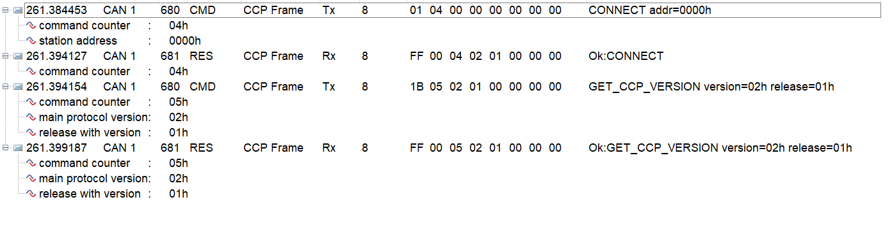
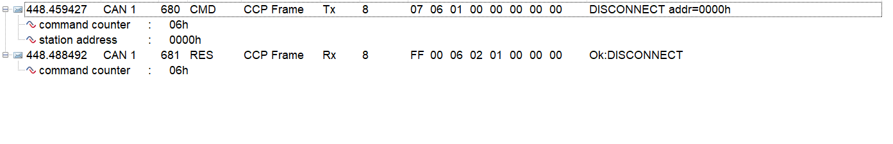
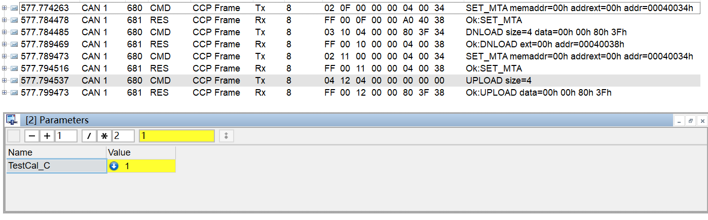
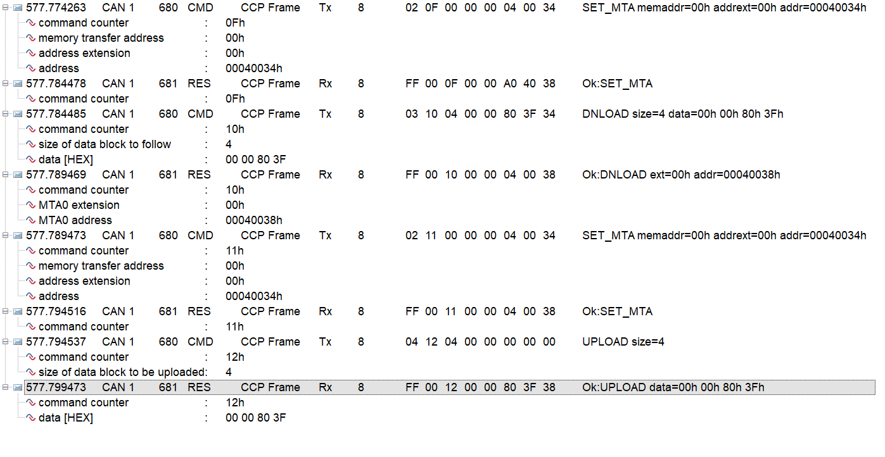
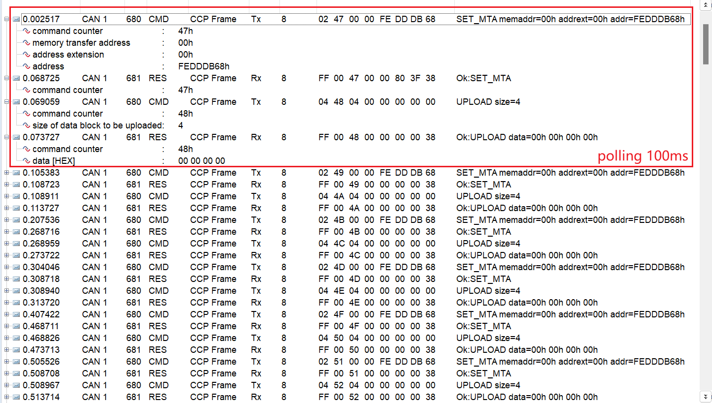
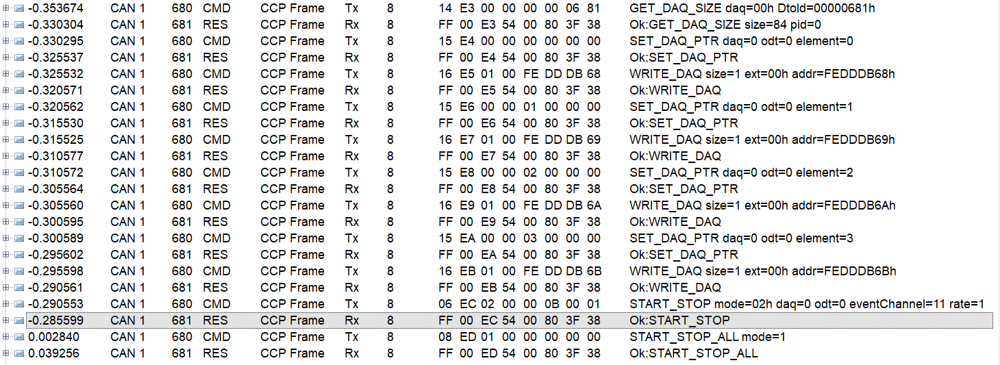
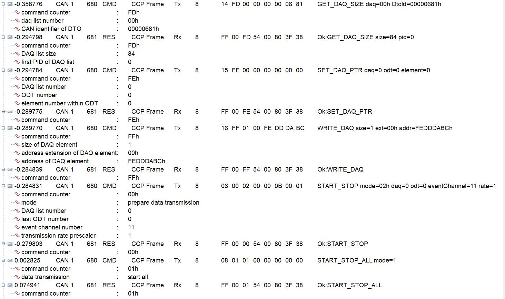
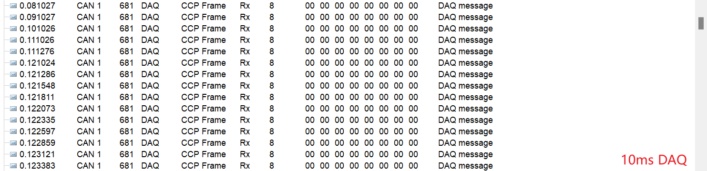

# CCP移植与测试

## CCP报文分析

### 连接流程

如图，上位机发送01连接指令并带上地址信息，一般都为0，如有多个ECU可区分。
然后查询CCP协议版本，上位机根据版本信息可得出ECU支持的功能。

### 断开流程

上位机发送07连接指令并带上地址信息，一般都为0，如有多个ECU可区分。

### 标定流程

1. 设置MTA地址
2. 发送DOWNLOAD指令，带长度和数据
3. 设置MTA地址（可选）
4. 发送UPLOAD指令，带长度（可选）
5. 确认修改成功，更新UI显示

### Polling流程

1. 设置MTA地址
2. 发送UPLOAD指令，带长度
3. UI显示数值，根据周期循环

### DAQ设置流程

1. 获取相关DAQ编号的大小（本测试为DAQ0）
2. 设置DAQ指针（本测试其中之一：DAQ0的ODT0的第一个元素）
3. 写DAQ（地址和长度），表示该DAQ指针需要存从该地址起为该长度的数据
4. 重复2和3将所有DAQ设置完成

### DAQ启动流程

1. 设置单个DAQ的模式、事件通道等等（多个的话重复步骤）
2. 启动停止所有DAQ

