# XCP移植与测试

## XCP onCAN报文分析(INCA静态DAQ)

### 连接流程

1. 发送连接指令并获取参数
2. 获取状态
3. 分别计算两个页面的校验和
4. 设置标定页面

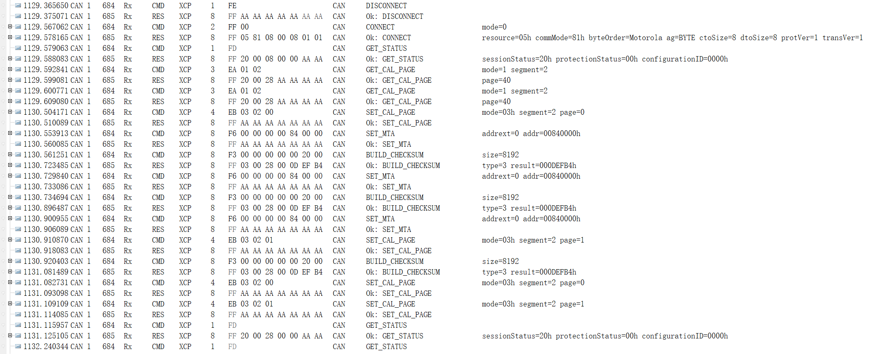

以下为报文展开：

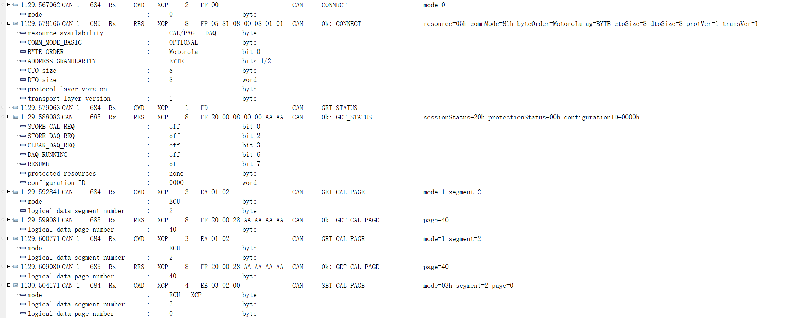
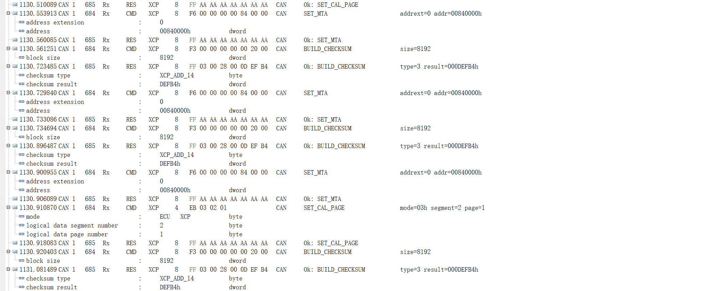

### 标定流程

1. 设置MTA地址
2. 发送DOWNLOAD指令，带长度和数据

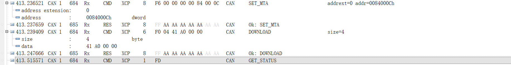

### Polling流程

1. 发送SHORT_UPLOAD指令，长度+地址
2. UI显示数值，根据周期循环

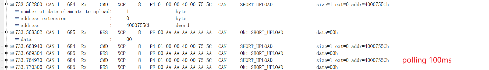

### DAQ流程

1. 释放DAQ
2. 分配DAQ、ODT、Entry，类似CCP的DAQ指针
3. 写DAQ（地址和长度）
4. 重复2和3将所有DAQ设置完成
4. 设置DAQ的模式
4. 启动该DAQ
4. 同步启动所有DAQ

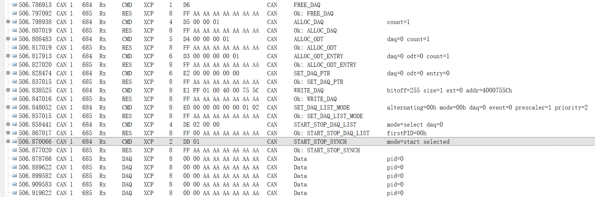

以下为报文展开：
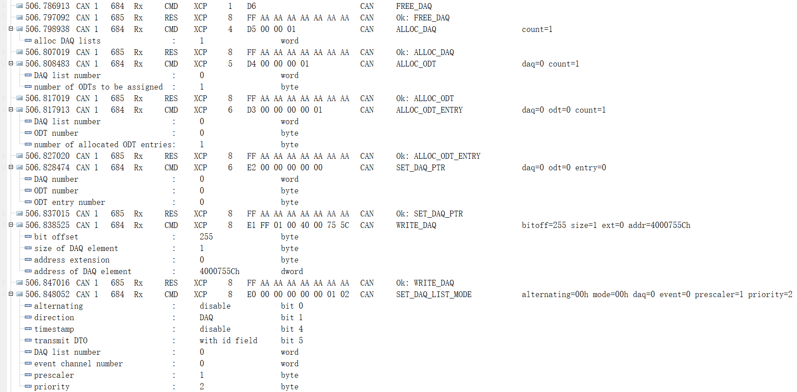
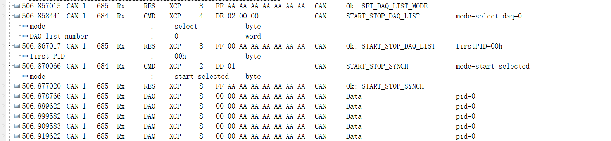

## XCP onCAN报文分析(APE模拟动态DAQ)

### 连接流程

1. 发送连接指令并获取参数
2. 获取状态
2. 解锁资源
3. 获取DAQ表信息
3. 解锁资源
4. 设置标定页面

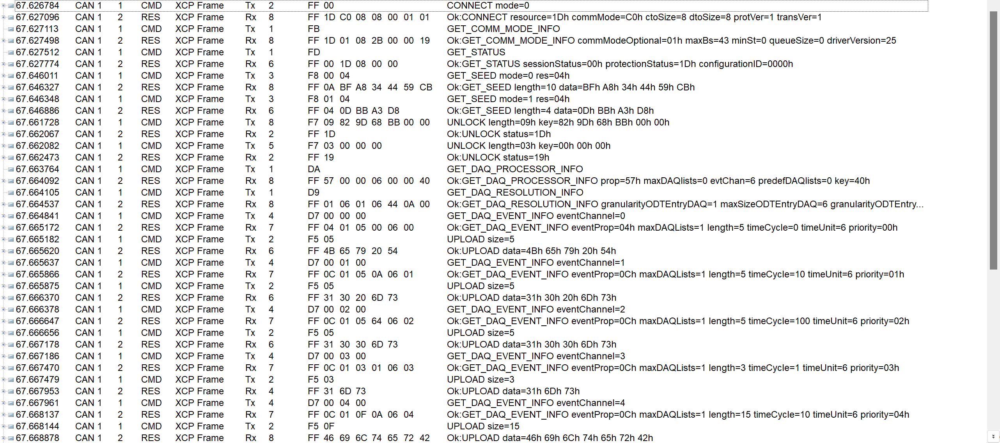
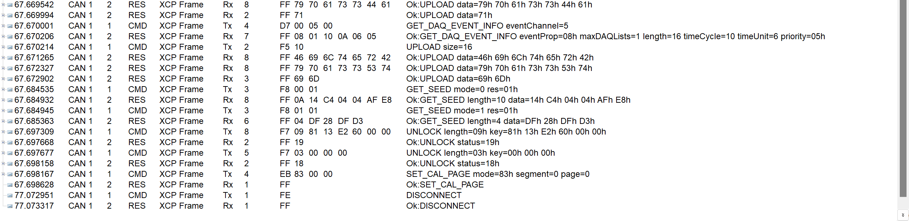

### 标定流程

1. 设置MTA地址
2. 发送DOWNLOAD指令，带长度和数据
3. 设置MTA地址
4. 发送UPLOAD指令，带长度
5. 确认修改成功并显示

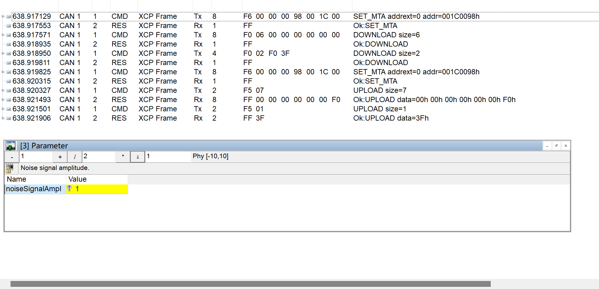

### Polling流程

1. 发送SHORT_UPLOAD指令，长度+地址
2. UI显示数值，根据周期循环

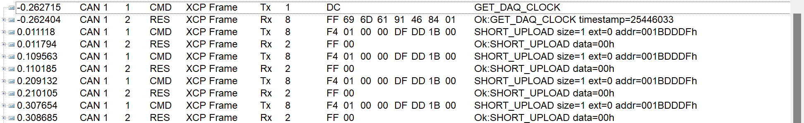

### DAQ流程

1. 获取DAQ信息
1. 释放DAQ
2. 分配DAQ、ODT、Entry，类似CCP的DAQ指针
3. 写DAQ（地址和长度）
4. 重复2和3将所有DAQ设置完成
4. 设置DAQ的模式
4. 启动该DAQ
4. 同步启动所有DAQ

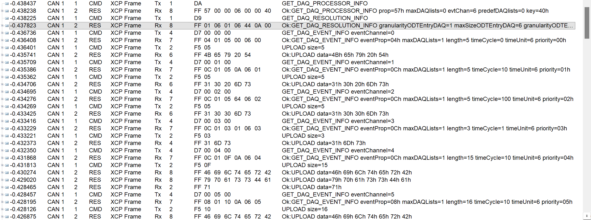
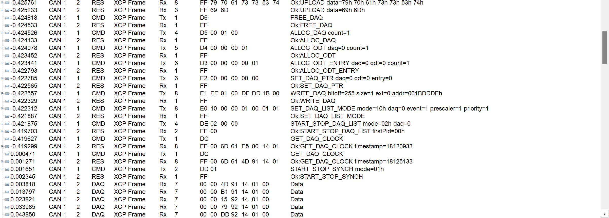

## XCP onCAN报文分析(APE连接ECU)

### 连接流程

1. 发送连接指令并获取参数
2. 获取状态

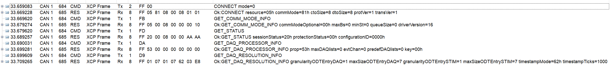
以下为报文展开：
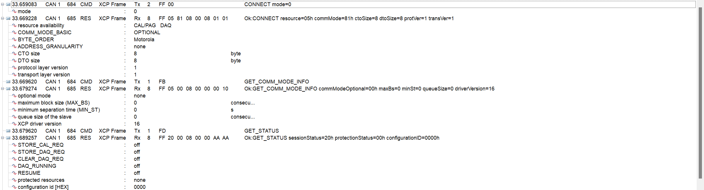
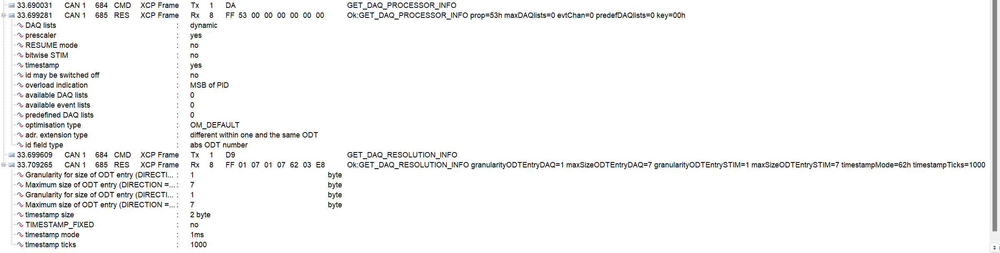

### 标定流程

1. 设置MTA地址
2. 发送DOWNLOAD指令，带长度和数据
3. 设置MTA地址
4. 发送UPLOAD指令，带长度
5. 确认修改成功并显示

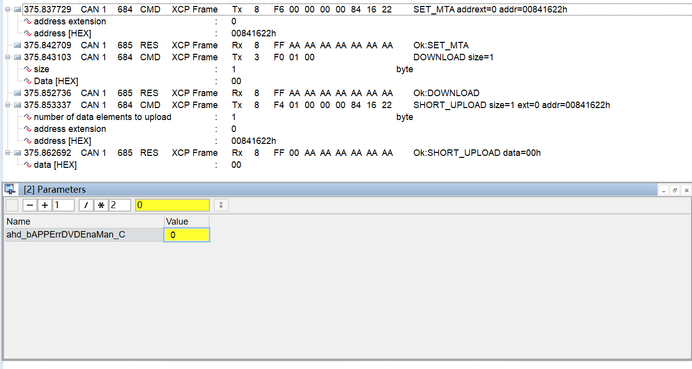

### Polling流程

1. 发送SHORT_UPLOAD指令，长度+地址
2. UI显示数值，根据周期循环

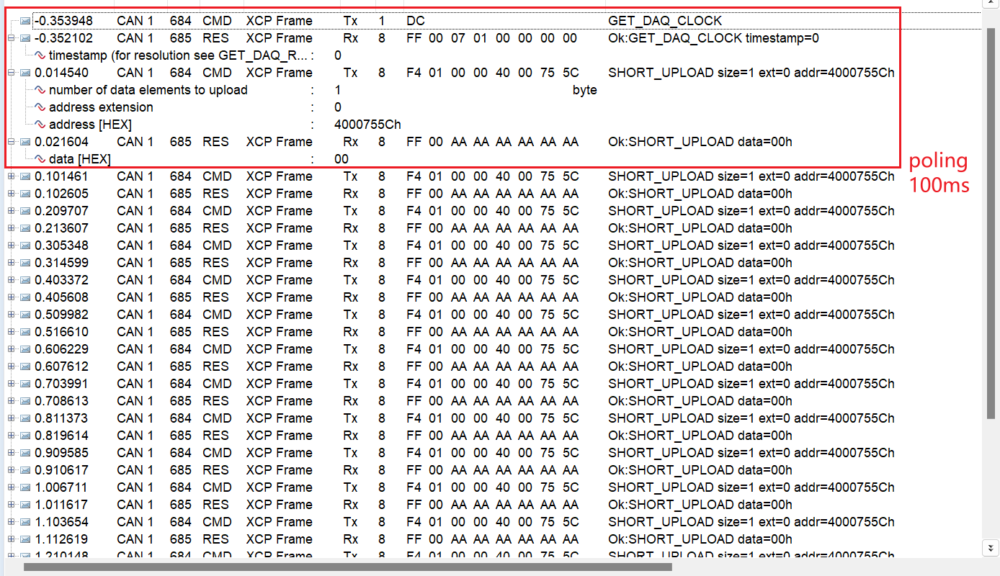